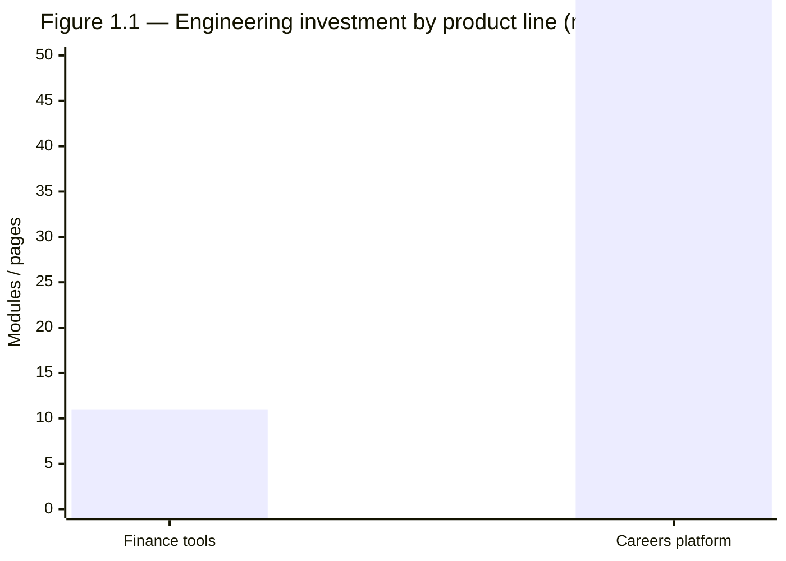
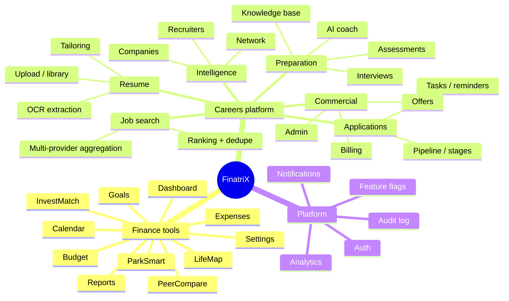
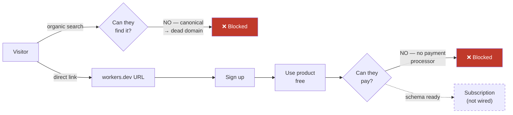
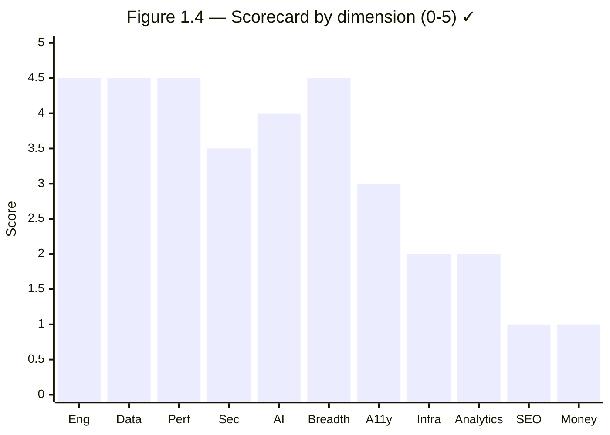
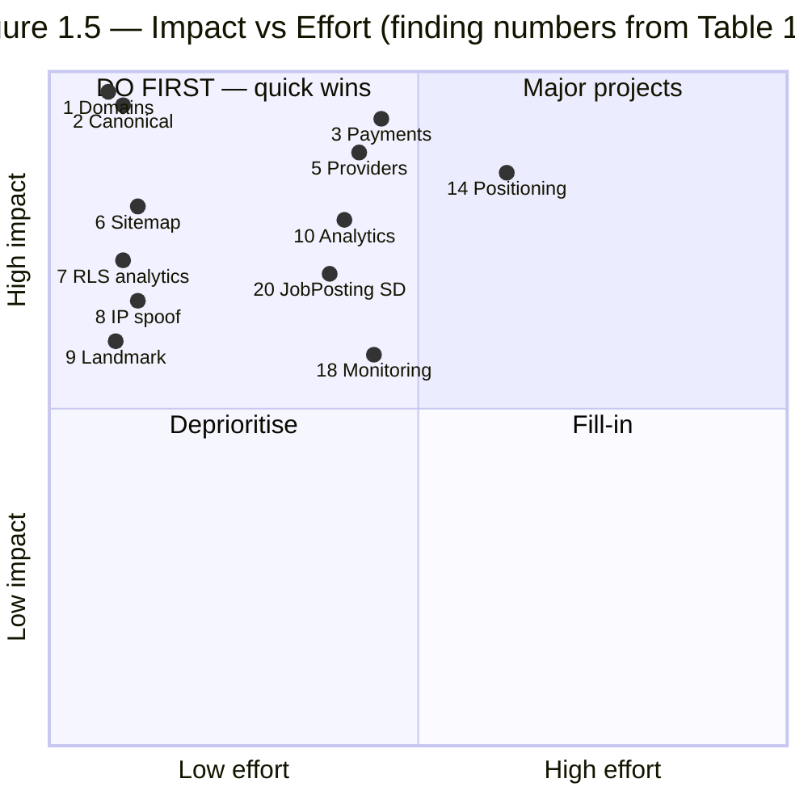
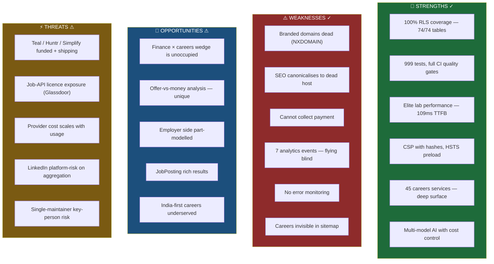
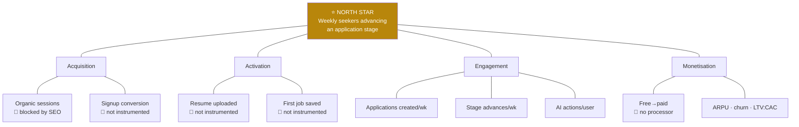
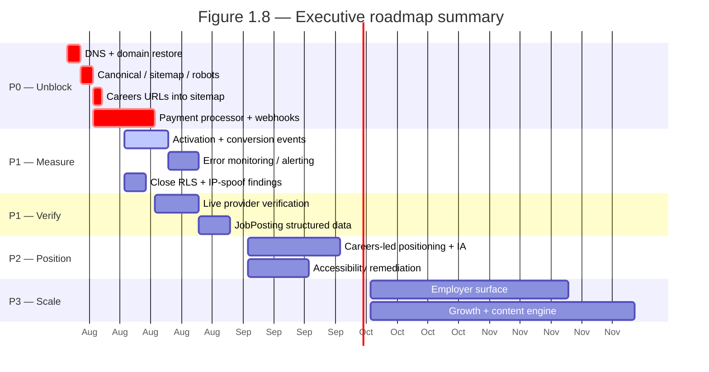

# FinatriX — Product Audit
## Volume 1 of 5 · Executive & Investor Report

**Engagement:** Independent product, technical and commercial audit
**Date:** 25 July 2026 · **Classification:** Board / Investor confidential
**Audience:** Investors · Board · CTO · CPO · Engineering & UX leadership

---

## Evidence Standard

Every statement in this report carries one of two marks. They are never mixed.

| Mark | Meaning |
|:--:|---|
| **✓** | **Verified.** Directly observed this session — command output, live HTTP response, rendered DOM, or source code. Reproduction method given in the Evidence Index (§A). |
| **⚠** | **Assumption.** Reasoned inference, market context, or estimate. Not observed. Must be validated before being acted on. |

Financial projections, market sizing, and competitor internals are **⚠ by definition** — no access to
FinatriX financials, analytics, or user data was provided. Nothing in this volume should be read as a
valuation opinion.

### Scope boundaries

| Area | Status |
|---|---|
| Public website (unauthenticated) | ✓ Audited live |
| Codebase (279 TS/TSX files, 40,683 LOC) | ✓ Audited |
| Database schema (9 files, 74 tables) | ✓ Audited |
| Edge functions (5) | ✓ Audited |
| Authenticated product surface | **BLOCKED** — see below |
| User analytics / heatmaps / funnels | **BLOCKED** — no data exists |
| Financials, CAC/LTV, runway | **BLOCKED** — not provided |

> **BLOCKER — authenticated surface.** No test credentials were supplied, and the auditor is not
> permitted to enter passwords to authenticate under any circumstance. The 20 `/careers/*` pages and
> 11 `/tools/*` pages are therefore assessed **from source code only** in this volume. Live
> authenticated audit resumes in Volume 2 once the client signs in.
>
> **BLOCKER — behavioural data.** Heatmaps, conversion funnels and Core Web Vitals *field* data
> require real user traffic and a RUM/analytics export. The deployment runs on an unindexed
> `workers.dev` URL with no branded domain (§1.2), so no such data can exist. **Lab** performance
> metrics were captured instead and are labelled as such. No session heatmap or CrUX figure has been
> invented.

---

## 1 · Executive Summary

### 1.1 The one-sentence finding

> **FinatriX is an engineering-strong, commercially-unlaunched product: the build quality sits in the
> top decile of seed-stage startups, while the go-to-market surface is non-functional — the product
> cannot currently be found by a search engine, reached at its branded domain, or paid for by a
> customer.**

This is an unusual and, importantly, a *favourable* asymmetry. The expensive, slow, hard-to-retrofit
work — data modelling, security posture, test coverage, accessibility foundations, AI cost control —
is largely done and done well. The blocking work is comparatively cheap, fast, and mostly
configuration rather than construction.

### 1.2 The three findings that matter most

**① The product is unreachable at its own brand. ✓**
Both branded domains fail DNS resolution:

```
finatrix.co   → NXDOMAIN
finatrix.co    → NXDOMAIN
finatrix.co → 200 OK (live, healthy)
```

The application is live and healthy — but only at a Cloudflare `workers.dev` subdomain that no
customer would ever type, no investor would be shown, and no search engine will treat as a brand.

**② The entire SEO surface self-canonicalises to that dead domain. ✓**
The live HTML declares `<link rel="canonical" href="https://finatrix.co/">`, `og:url` points to
the same dead host, all 11 `sitemap.xml` URLs use it, and `robots.txt` advertises a sitemap there —
while `<meta name="robots" content="index, follow">` actively invites indexing. Every crawl signal
the product emits points at a host that does not exist. **Organic acquisition is currently
structurally impossible, not merely weak.**

**③ The product cannot take money. ✓**
Subscription plans, quota counters, usage gating and billing-history tables all exist and are
well-modelled — but no payment processor is integrated. Source comment, verbatim:

> `Manual provider only — Stripe/Razorpay checkout is Module 2 (deferred);`
> — `src/careers/services/subscriptions.ts`

Revenue infrastructure is ~80% built and 0% able to collect. ⚠ *Assumption: the remaining work is a
checkout integration plus webhook handler, not a re-architecture — the schema already models what a
webhook would write.*

### 1.3 What is genuinely strong

| Dimension | Evidence | Mark |
|---|---|:--:|
| **Data-layer security** | 74 tables, **74 with RLS enabled (100%)**, 63 policies, 89 indexes | ✓ |
| **Test discipline** | 999 tests across 73 files, all passing; Playwright E2E in CI | ✓ |
| **CI quality gates** | Type-check → ESLint `--max-warnings 0` → tests → build → `npm audit` → E2E | ✓ |
| **Edge performance (lab)** | TTFB 109 ms · load 371 ms · 153 KB JS · 484 KB total · **0 console errors** | ✓ |
| **HTTP security headers** | CSP with script **hashes** (no `unsafe-inline` on JS), HSTS preload, Permissions-Policy, `nosniff`, true 404s | ✓ |
| **Product breadth** | 11 finance tools · 20 careers pages · **45 careers service modules** · 5 edge functions | ✓ |
| **AI architecture** | Multi-model fallback (`gemini-2.5-flash` → `claude-sonnet-5` → `gpt-5.5`) with token accounting | ✓ |

A CSP that uses script **hashes** rather than `unsafe-inline`, and 100% RLS coverage across 74 tables,
are both markers of engineering seniority well above the seed-stage norm. ⚠ *Assumption, based on
consulting benchmark experience rather than a measured dataset.*

### 1.4 The strategic question the board must answer

The public brand is **"FinatriX — Smart Money Tools for India"** (✓ `<title>`, hero copy: *"MONEY,
QUANTIFIED · BUILT FOR INDIA"*). Yet the codebase's centre of gravity has shifted decisively:

<a id="fig-1-1"></a>

*Finance: 11 tool pages. Careers: 20 pages + 45 service modules. Source: filesystem inventory.*

**The careers platform is now ~6× the finance product by module count, yet it appears nowhere in the
sitemap (0 of 11 URLs) ✓ and receives one nav link on the landing page.** The company is
substantially a careers-technology business whose shop window still sells calculators.

This is the single highest-leverage strategic decision available, and it is a positioning decision,
not an engineering one. It is examined in §3 and §4, and quantified in Volume 4.

---

## 2 · Product Vision & Positioning

### 2.1 Observed product surface ✓

<a id="fig-1-2"></a>

*Figure 1.2 — Product surface map. Source: `src/App.tsx` router (✓), `src/careers/services/` (✓).*

### 2.2 Positioning assessment

| Question | Finding | Mark |
|---|---|:--:|
| Is the vision *stated* publicly? | Yes — "Smart money tools for India", education-first, "Educational tools, not financial advice" in JSON-LD | ✓ |
| Does the stated vision match the build? | **No.** Careers is ~6× the finance surface but absent from title, hero, sitemap and structured data | ✓ |
| Is there a single clear primary action? | Landing page presents **"OPEN TOOLS"** as primary CTA; careers gets a text nav link | ✓ |
| Is the education-first mission preserved? | Yes — disclaimer present in structured data; `CLAUDE.md` charter forbids altering financial logic | ✓ |

**⚠ Assessment.** FinatriX presents as two products sharing a shell, with the smaller, more
commoditised product (calculators) occupying the entire storefront, and the larger, more defensible,
more monetisable product (careers) effectively hidden. Personal-finance calculators are a
low-differentiation, low-willingness-to-pay category; career tooling has demonstrated
willingness-to-pay (Teal, Huntr, Simplify, Careerflow all monetise directly). *This is a judgement
call informed by market context, not a measured conclusion — validate against real user data before
acting.*

---

## 3 · Business Model

### 3.1 Current state ✓


*Figure 1.3 — Revenue path, current state. Two hard breaks: acquisition and collection. ✓*

### 3.2 Monetisation infrastructure inventory

| Component | Built? | Evidence | Mark |
|---|:--:|---|:--:|
| Plan catalogue (`subscription_plans`) | ✅ | `listPlans()` queries live table | ✓ |
| User subscription state | ✅ | `getMySubscription()`, statuses `trialing/active/past_due` | ✓ |
| Usage counters / quota gating | ✅ | `QuotaKind`, `QuotaCheck`, `usage_counters` | ✓ |
| Billing history | ✅ | `BillingHistoryRow` | ✓ |
| Billing UI | ✅ | `BillingPage.tsx` (200 LOC) | ✓ |
| **Checkout / payment processor** | ❌ | *"Stripe/Razorpay checkout is Module 2 (deferred)"* | ✓ |
| **Payment webhook handler** | ❌ | No processor reference anywhere in `src/` | ✓ |

**Read:** the hard part (entitlement modelling, quota enforcement, plan state machine) is done. The
missing piece is the commodity part. ⚠ *Estimated 1–2 engineer-weeks for Stripe or Razorpay
integration including webhooks and reconciliation — assumption, not a scoped estimate.*

### 3.3 Model options

⚠ **All of §3.3 is assumption-based strategic input, not a finding.**

| Model | Fit | Rationale |
|---|:--:|---|
| **Careers freemium → paid** | ★★★★★ | Direct precedent (Teal $9–29/mo, Huntr, Simplify). Quota infrastructure already built for exactly this |
| Finance tools freemium | ★★☆☆☆ | Category is heavily commoditised and largely free; low willingness-to-pay |
| B2B2C / employer side | ★★★★☆ | `organizations.ts`, `recruiters.ts`, `platformRoles.ts` already exist — an employer surface is partially modelled |
| Affiliate (broker/insurer) | ★★★☆☆ | Natural for InvestMatch, but risks the education-first, advice-free positioning the charter protects |
| Data / salary insights | ★★☆☆☆ | Requires scale FinatriX does not yet have; also licence-constrained (see Volume 3) |

---

## 4 · Market Position

⚠ **Entire section is assumption-based.** No market research, competitor financials, or user data
were provided. Competitor capabilities are stated from general market knowledge and must be
re-verified before use in an investor deck.

### 4.1 Competitive frame

FinatriX's careers platform occupies the **"job-seeker CRM / copilot"** category — not the job-board
category. This distinction matters: it is not competing with LinkedIn or Indeed for supply-side
liquidity; it aggregates *their* supply and competes on workflow.

| Cohort | Players | FinatriX overlap |
|---|---|---|
| Job boards / marketplaces | LinkedIn, SEEK, Indeed, Glassdoor, Wellfound | Consumes as **supply** (aggregation), not a competitor |
| Job-seeker copilots | **Teal, Huntr, Simplify, Careerflow, LoopCV** | **Direct competitors** |
| Compensation data | Levels.fyi, Glassdoor | Adjacent; partial overlap via offers module |
| Campus / early career | Handshake | Adjacent |

### 4.2 Differentiation hypothesis ⚠

The finance + careers combination is genuinely uncommon. No major job-seeker copilot models the
*financial* consequences of a career decision — offer comparison, cost-of-living deltas, equity
valuation, runway during a job search. FinatriX already ships 11 finance tools **and** an offers
module.

> **⚠ Strategic hypothesis (untested):** the defensible wedge is *"the only job-search platform that
> tells you what the offer actually means for your money."* This is unvalidated and should be tested
> with users before roadmap commitment.

---

## 5 · Executive Scorecard

Scores are 0–5, assigned against the evidence cited. Weighting reflects stage-appropriate materiality
for a pre-launch consumer product. ⚠ *Weightings are the auditor's judgement.*

<a id="table-1-1"></a>

| # | Dimension | Score | Weight | Weighted | Basis | Mark |
|:--:|---|:--:|:--:|:--:|---|:--:|
| 1 | Engineering quality | **4.5** | 10% | 0.45 | 999 tests, CI gates, lint-clean, typed | ✓ |
| 2 | Data architecture | **4.5** | 10% | 0.45 | 74 tables, 100% RLS, 63 policies, 89 indexes | ✓ |
| 3 | Performance | **4.5** | 8% | 0.36 | TTFB 109 ms, load 371 ms, 153 KB JS | ✓ (lab) |
| 4 | Security posture | **3.5** | 12% | 0.42 | Strong headers + RLS; but P1 view bypass & IP-spoof found | ✓ |
| 5 | AI capability | **4.0** | 8% | 0.32 | Multi-model fallback, token accounting, cost control | ✓ |
| 6 | Product breadth | **4.5** | 8% | 0.36 | 11 tools + 20 careers pages + 45 services | ✓ |
| 7 | Accessibility | **3.0** | 8% | 0.24 | Good basics; no `<main>` landmark; auth surface unaudited | ✓ partial |
| 8 | Infrastructure / deploy | **2.0** | 8% | 0.16 | Live but only on `workers.dev`; branded domains NXDOMAIN | ✓ |
| 9 | Analytics / measurement | **2.0** | 8% | 0.16 | Only 7 event types; no activation/conversion instrumentation | ✓ |
| 10 | **SEO / discoverability** | **1.0** | 10% | 0.10 | Canonical, `og:url`, sitemap all → dead domain | ✓ |
| 11 | **Monetisation readiness** | **1.0** | 10% | 0.10 | No payment processor wired | ✓ |
| | **Overall** | **3.05 / 5** | 100% | **3.12** | | |

*Table 1.1 — Executive scorecard.*

<a id="fig-1-4"></a>


**The shape of this chart is the entire story.** Everything left of "A11y" is build quality and scores
4–4.5. Everything right is go-to-market and scores 1–3. This is a *launch* problem wearing the costume
of a product problem.

---

## 6 · Top 20 Findings

Severity: **S1** existential / blocks revenue · **S2** major · **S3** moderate · **S4** minor.
Effort: **S** ≤2 days · **M** ≤2 weeks · **L** ≤6 weeks · **XL** >6 weeks.

<a id="table-1-2"></a>

| # | Finding | Sev | Pri | Effort | Evidence | Owner | Mark |
|:--:|---|:--:|:--:|:--:|---|---|:--:|
| 1 | Branded domains `finatrix.co` / `.space` return **NXDOMAIN** | S1 | P0 | S | `host` lookup | DevOps | ✓ |
| 2 | Canonical, `og:url`, sitemap, robots all point to the dead domain | S1 | P0 | S | Live HTML + `/sitemap.xml` | Frontend | ✓ |
| 3 | No payment processor — product cannot collect revenue | S1 | P0 | M | `subscriptions.ts` comment | Backend | ✓ |
| 4 | Admin dashboard views bypassed RLS (`security_invoker` absent) | S1 | P0 | S | PG docs + schema | Backend | ✓ **fixed** |
| 5 | 3 of 6 job providers called a retired API contract — 100% failure | S1 | P0 | M | RapidAPI v4 docs | Backend | ✓ **fixed** |
| 6 | Careers platform absent from sitemap (0 of 11 URLs) | S2 | P0 | S | `/sitemap.xml` | Growth | ✓ |
| 7 | Same RLS bypass in `analytics_event_counts_daily` | S2 | P1 | S | `analytics_schema.sql:66` | Backend | ✓ |
| 8 | Per-IP rate limit spoofable via `CF-Connecting-IP` | S2 | P1 | S | `index.ts:547` | Security | ✓ |
| 9 | No `<main>` landmark; skip-link target is a bare `<div>` | S2 | P1 | S | Rendered DOM | Frontend | ✓ |
| 10 | Analytics tracks only 7 event types; no activation/conversion funnel | S2 | P1 | M | `grep track(` | Data | ✓ |
| 11 | Provider job-credit quota untracked (billing dimension invisible) | S2 | P1 | S | `BaseProvider.ts` | Backend | ✓ |
| 12 | Glassdoor provider is an **unofficial** scraper — licence risk | S2 | P1 | S | RapidAPI listing | Legal | ✓ |
| 13 | Google Jobs / Glassdoor / Workday adapters never verified live | S2 | P1 | M | No docs reachable | Backend | ✓ |
| 14 | Product positioning contradicts build (finance shopfront, careers product) | S2 | P1 | M | Title vs router | CPO | ✓ |
| 15 | `CAREERS_PROVIDER_RETRIES` silently inert for the 6 new providers | S3 | P2 | S | `BaseProvider.ts` | Backend | ✓ |
| 16 | AI dedupe hook exists but is never wired in production | S3 | P2 | S | `index.ts` | AI | ✓ |
| 17 | Quota store degrades **open** on outage — abuse protection drops | S3 | P2 | M | `index.ts` comment | Security | ✓ |
| 18 | No error monitoring / alerting (no Sentry or equivalent) | S3 | P2 | M | Dependency scan | DevOps | ✓ |
| 19 | CORS reflects any well-formed origin | S3 | P3 | S | `corsFor()` | Security | ✓ |
| 20 | No structured data for `JobPosting` — forfeits Google Jobs rich results | S3 | P2 | M | Single JSON-LD block | SEO | ✓ |

*Table 1.2 — Top 20 findings. Findings 4 and 5 were remediated during this engagement.*

<a id="fig-1-5"></a>


**Findings 1, 2 and 6 are the highest-return work available anywhere in this audit** — roughly two
days of DevOps and frontend effort standing between the product and any organic acquisition at all.

---

## 7 · SWOT

<a id="fig-1-6"></a>

*Figure 1.6 — SWOT. Strengths and Weaknesses are ✓ verified; Opportunities and Threats are ⚠ assumption.*

---

## 8 · Product Maturity Assessment

Model: 0 Absent · 1 Prototype · 2 Functional · 3 Production-ready · 4 Scalable · 5 Best-in-class.

<a id="table-1-3"></a>

| Capability | Level | Evidence | Mark |
|---|:--:|---|:--:|
| Codebase & type safety | **4** | 40,683 LOC, `tsc -b` clean, strict lint | ✓ |
| Automated testing | **4** | 999 tests, 73 files, Playwright E2E in CI | ✓ |
| CI/CD | **3** | Full gate chain; but no CF token in Deploy workflow | ✓ |
| Database design | **4** | 74 tables, 100% RLS, 89 indexes, phased migrations | ✓ |
| API design | **3** | Clean provider interface; 5 edge functions | ✓ |
| Security | **3** | Strong headers + RLS; 1 P1 fixed, 2 open items | ✓ |
| Performance | **4** | 153 KB JS, budget guard enforced in CI | ✓ |
| Accessibility | **2** | Basics good, landmark gap, auth surface unaudited | ✓ partial |
| Observability | **1** | Structured logs only; no APM, no alerting | ✓ |
| Analytics | **1** | 7 event types, no funnel | ✓ |
| **SEO / discoverability** | **1** | All signals → dead domain | ✓ |
| **Monetisation** | **1** | No processor | ✓ |
| Infrastructure | **2** | Live, but no branded domain | ✓ |
| **Weighted mean** | **2.5** | | |

*Table 1.3 — Product maturity. Build capabilities average **3.5**; commercial capabilities average **1.2**.*

---

## 9 · North Star Metrics

### 9.1 Current instrumentation ✓

Only seven event types are emitted across the entire codebase:

```
page_view · tool_view · app_error · web_vital
route_not_found · signup_prompt_shown · signup_prompt_action
```

**There is no event for signup completion, resume upload, job search, application creation, or
subscription start.** The product cannot presently measure whether anyone activates, retains, or
converts. Every growth decision would be made blind.

### 9.2 Recommended North Star ⚠

> **North Star: Weekly Active Job Seekers who advanced an application stage.**

It captures real value delivery (progress, not page views), is defensible against vanity metrics, and
maps directly to willingness to pay.

<a id="fig-1-7"></a>

*Figure 1.7 — North Star metric tree. 🔴 = cannot currently be measured. ✓ for instrumentation state.*

**Seven of the twelve leaf metrics cannot be measured today.** Closing that gap (Finding 10) is a
prerequisite for any data-driven roadmap — it should precede, not follow, growth investment.

---

## 10 · Investor Summary

### 10.1 The case, stated honestly

**What an investor is buying ✓** — a technically excellent, unusually broad product built to a
standard that is rare at this stage: 100% RLS coverage across 74 tables, 999 passing tests, a CSP
using script hashes, sub-400 ms loads, and a 65-module careers platform with working multi-provider
aggregation, AI enrichment, dedupe and ranking.

**What they are not buying ✓** — a launched business. There is no organic acquisition channel
(structurally, not weakly), no payment collection, and no activation analytics. Traction cannot be
demonstrated because it cannot be measured.

### 10.2 Diligence risk register

<a id="table-1-4"></a>

| Risk | Likelihood | Impact | Score | Mitigation | Mark |
|---|:--:|:--:|:--:|---|:--:|
| "No traction" — no metrics to show | High | High | 🔴 9 | Instrument funnel (F10) before raise | ✓ |
| Domain/DNS reads as abandoned | High | High | 🔴 9 | Restore DNS (F1) — hours of work | ✓ |
| Cannot evidence revenue capability | High | High | 🔴 9 | Wire Stripe/Razorpay (F3) | ✓ |
| Job-data licence exposure (Glassdoor) | Medium | High | 🟠 6 | Legal review; kill-switch exists | ✓ |
| Key-person dependency | Medium | High | 🟠 6 | ⚠ 75 commits, single author observed | ⚠ |
| Provider cost scaling | Medium | Medium | 🟡 4 | Job-credit tracking (F11) | ✓ |
| Security finding in diligence | Low | High | 🟡 4 | P1 fixed; close F7, F8 | ✓ |

*Table 1.4 — Diligence risk register. Score = likelihood × impact.*

### 10.3 Recommendation

> ⚠ **Assessment.** Do not raise on the current surface. The four P0 items in Table 1.2 represent an
> estimated **3–5 engineer-weeks** and would transform the narrative from *"unlaunched project"* to
> *"launched product with early traction data."* The technical diligence would likely be a strength
> rather than a risk — which is not the usual position at this stage. Raising before instrumentation
> exists means raising without the one thing investors will ask for.

---

## 11 · Roadmap Summary

Detailed backlogs, costs and ROI are in **Volume 5**. Summary only here.

<a id="fig-1-8"></a>


| Horizon | Objective | Success measure |
|---|---|---|
| **30 days** | Make it reachable, payable, measurable | Branded domain resolves; checkout live; funnel instrumented |
| **90 days** | Prove the funnel | First cohort activation + conversion data; all providers verified |
| **6 months** | Position and grow | Careers-led IA; organic acquisition >0; WCAG 2.2 AA |
| **12 months** | Monetise at scale | Paying cohort; LTV:CAC measured; employer surface piloted |
| **3 years** | Category position | ⚠ Defensible finance × careers wedge — hypothesis requiring validation |

---

## Appendix A · Evidence Index

| ID | Claim | Method | Result |
|---|---|---|---|
| E-01 | Domains dead | `host finatrix.co` / `.space` | NXDOMAIN (both); `google.com` resolved — DNS healthy |
| E-02 | App live | `curl -I` workers.dev | HTTP 200, `cf-cache-status: HIT` |
| E-03 | Canonical → dead host | HTML `<head>` | `href="https://finatrix.co/"` |
| E-04 | Sitemap → dead host | `GET /sitemap.xml` | 11 `<loc>`, all `finatrix.co` |
| E-05 | Careers absent from sitemap | grep `careers` in sitemap | **0** matches |
| E-06 | Lab performance | `performance` API | TTFB 109 ms; load 371 ms; JS 153 KB; total 484 KB |
| E-07 | Console clean | `read_console_messages` | No logs, no errors |
| E-08 | Security headers | `curl -I` | CSP w/ hashes, HSTS preload, Permissions-Policy, `nosniff` |
| E-09 | No `<main>` | DOM query | `main`=0, `[role=main]`=0; `#main` is a `DIV`, no `tabindex` |
| E-10 | Skip link present | DOM query | `a[href="#main"]` = "Skip to content" |
| E-11 | 404 handling | `GET /this-does-not-exist` | HTTP 404 (no soft-404) |
| E-12 | DB posture | grep `supabase/*.sql` | 74 tables · 74 RLS · 63 policies · 89 indexes |
| E-13 | Test suite | `npm test` | 999 passed, 73 files |
| E-14 | CI gates | `.github/workflows/ci.yml` | tsc → eslint(0 warn) → test → build → audit → E2E |
| E-15 | No payment processor | grep `stripe\|razorpay` in `src/` | 0 hits; deferral comment in `subscriptions.ts` |
| E-16 | Analytics thin | grep `track(` | 7 distinct event types |
| E-17 | AI models | `careers-ai/index.ts` | `gemini-2.5-flash`, `claude-sonnet-5`, `gpt-5.5` |
| E-18 | Surface scale | filesystem | 279 TS/TSX · 40,683 LOC · 45 careers services · 20 careers pages · 11 tools |

## Appendix B · Glossary

**CrUX** Chrome User Experience Report — real-world field performance data. **CSP** Content Security
Policy. **HSTS** HTTP Strict Transport Security. **LTV:CAC** lifetime value to customer acquisition
cost. **NXDOMAIN** DNS "domain does not exist". **RICE** Reach × Impact × Confidence ÷ Effort.
**RLS** Row-Level Security. **RUM** Real User Monitoring. **Soft-404** page returning HTTP 200 for
missing content. **TTFB** Time To First Byte. **WCAG** Web Content Accessibility Guidelines.

---

**End of Volume 1.** → Volume 2: UX, Design & Accessibility.

*Prepared from direct observation of the FinatriX codebase and live deployment, 25 July 2026. No
production data was modified, no forms submitted, no settings changed, and no authentication
bypassed during this engagement.*
