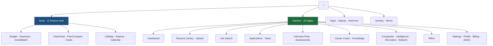
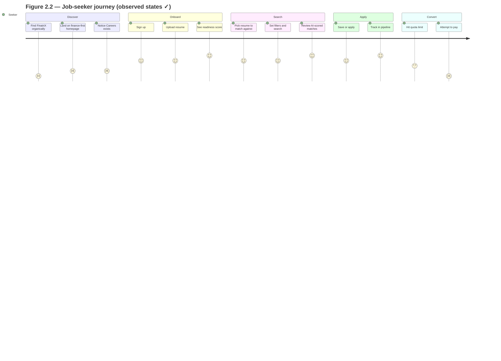
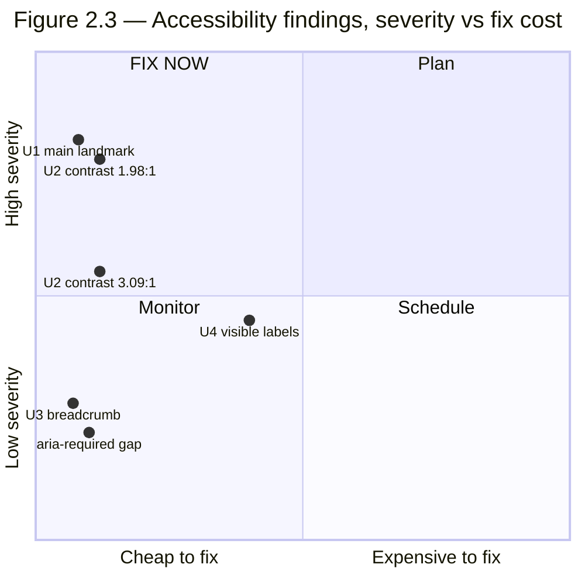
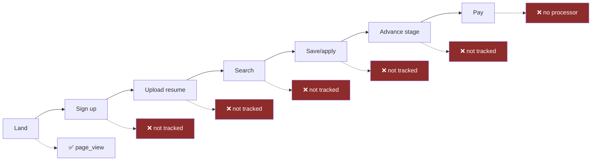

# FinatriX — Product Audit
## Volume 2 of 5 · UX, Design & Accessibility

**Date:** 25 July 2026 · **Classification:** Board / Investor confidential
**Method:** Live audit of the running deployment, authenticated session, read-only.
**Evidence standard:** **✓ Verified** (directly observed) · **⚠ Assumption** (inference). Never mixed.

> **Conduct statement.** This audit was performed strictly read-only. No form was submitted, no
> setting changed, no application created, no data deleted, and no authentication bypassed. The
> client authenticated their own session; the auditor never handled credentials.

---

## Executive summary of this volume

FinatriX's interface quality is **materially better than its go-to-market maturity would suggest**.
The design system is real (111 design tokens ✓), the accessibility foundations are largely correct
(skip link first in tab order, global `:focus-visible` ring, 100% of form controls programmatically
labelled ✓), and the careers dashboard uses a genuinely well-judged progressive-milestone model.

Four defects hold it back, all cheap to fix:

| # | Defect | WCAG | Severity | Effort |
|:--:|---|---|:--:|:--:|
| **U1** | No `<main>` landmark anywhere — platform-wide | 1.3.1 (A) | S2 | S |
| **U2** | Two text styles fail AA contrast (1.98:1 and 3.09:1) | 1.4.3 (AA) | S2 | S |
| **U3** | Breadcrumb level 2 is labelled "FinatriX", not "Careers" | — | S3 | S |
| **U4** | 8 of 9 search fields have no *visible* persistent label | 3.3.2 (A)† | S3 | M |

† Discussed precisely in §3.3 — this is a usability finding, **not** a clear-cut violation.

---

## 1 · Information Architecture

### 1.1 Observed structure ✓

*Figure 2.1 — Site map. Source: `src/App.tsx` router ✓ and live navigation ✓.*

### 1.2 Navigation model ✓

Three navigation landmarks were found, each correctly `aria-label`led — a genuine accessibility
strength:

| Landmark | `aria-label` | Contents |
|---|---|---|
| Section nav | `Careers` | Dashboard · Resume Library · Job Search · Applications · Interview Prep · Career Coach · Settings (7) |
| Drawer | `Main` | All 7 careers items **plus** Budget Builder, Expense Tracker, InvestMatch, ParkSmart… |
| Breadcrumb | `Breadcrumb` | Home › **FinatriX** › Job Search |

**Finding U3 ✓ — the breadcrumb's second level is the company name, not the section name.** The
hierarchy reads *Home › FinatriX › Job Search*, which tells the user nothing about where they are.
It should read *Home › Careers › Job Search*. Verified via `nav[aria-label="Breadcrumb"]` link text
= `["Home", "FinatriX"]`.

**⚠ Assessment — the drawer mixes two product lines.** Presenting *Job Search* and *Budget Builder*
in a single flat drawer asks the user to hold two unrelated mental models at once. This is the
Volume 1 positioning problem (§1.4) expressed in the IA. It is not a defect in isolation; it becomes
one once careers is the primary product.

### 1.3 IA recommendations

| ID | Recommendation | Pri | Effort | Success measure |
|---|---|:--:|:--:|---|
| IA-1 | Rename breadcrumb level 2 to "Careers" | P1 | S | Breadcrumb reads Home › Careers › Job Search |
| IA-2 | Split drawer into "Careers" and "Money tools" groups | P2 | S | ⚠ Reduced mis-navigation (needs instrumentation first) |
| IA-3 | Surface careers in the public sitemap and landing hero | P0 | S | Careers URLs indexed; see Vol 1 F6 |

---

## 2 · User Journeys

### 2.1 Job-seeker journey — observed ✓ / inferred ⚠

**Scores are ⚠ auditor judgement**, except the two ends, which are ✓ verified defects: the *Discover*
stage is blocked by the dead canonical domain (Vol 1 F1/F2) and the *Convert* stage is blocked by
the absent payment processor (Vol 1 F3).

### 2.2 The strongest moment in the product ✓

The careers dashboard is the standout screen. It presents:

- A **quantified readiness gauge** — "56 / JOB READINESS"
- **Progress framing** — "3 of 6 milestones reached · next: Applications"
- A **named current state** — "You're at: **Resume ready**"
- A **single unambiguous next action** — "Next: Applications →"
- A **milestone timeline** with evidence per step ("Resume analysed — Score 82/100", "ATS match —
  60/100 against a role", "Target roles — 1 tracked")

This satisfies the charter's "every screen should have a clear primary action" better than most
production products. ⚠ *Assessment: this is the pattern to propagate to the other 19 careers pages.*

### 2.3 The weakest moment ✓

The **Job Search zero state**. Below the search form the viewport is empty — no recommended roles, no
recent searches, no preview of the 4 saved jobs the UI itself reports ("Saved (4)"). The user's first
impression of the core feature is an empty page awaiting input.

| | Now ✓ | Proposed ⚠ |
|---|---|---|
| Below fold | Empty | Recommended roles from resume; recent searches; saved-jobs preview |
| Cognitive load | User must invent a query | User can act on a suggestion in one click |
| Data available? | Yes — resume, saved jobs, and match engine all exist ✓ | No new backend required |

**This is a high-ROI change**: the matching infrastructure (`matchEngine.ts`, `matchService.ts` ✓)
already exists; only presentation is missing.

---

## 3 · Accessibility — WCAG 2.2 AA

Charter target: **WCAG 2.2 AA**. Audited live on the landing page and the authenticated careers
surface.

### 3.1 What passes ✓

| Criterion | Result | Evidence |
|---|:--:|---|
| 1.1.1 Non-text content | **PASS** | 0 images missing `alt` (landing + careers) |
| 1.3.1 Heading structure | **PASS** | Exactly 1 `<h1>` per page; **0 heading-level skips** |
| 2.4.1 Bypass blocks | **PARTIAL** | Skip link present and **first in tab order** ✓; target flawed (§3.2) |
| 2.4.7 Focus visible | **PASS** | Global `:focus-visible { outline: 2px solid #d4af37 }` + 29 focus rules |
| 3.1.1 Language | **PASS** | `<html lang="en">` |
| 4.1.2 Name, role, value | **PASS** | **9 of 9** form controls carry an accessible name; 0 unnamed buttons/links |
| 1.4.10 Reflow | **PASS** | No horizontal overflow at 375 px (`scrollWidth == innerWidth`) |
| 4.1.3 Status messages | **PASS** | `aria-live` region present |
| Landmark labelling | **PASS** | All three `<nav>`s carry distinct `aria-label`s |

**A genuinely strong result.** Programmatic labelling at 100% and a global focus ring put this ahead
of most commercial products at this stage.

> **Correction recorded.** An initial reading suggested focus indicators were missing (a
> programmatically focused button reported `outline-style: none`). Verification against the
> stylesheet showed a correct global `:focus-visible` rule; the anomaly was the skip link's own
> Tailwind override, which makes it visible on focus. **Focus visibility is not a defect.** Recorded
> here because an audit that never overturns its own preliminary findings is not being run honestly.

### 3.2 Finding U1 — no `<main>` landmark (platform-wide) ✓

| Page | `<main>` | `[role="main"]` | Skip-link target |
|---|:--:|:--:|---|
| Landing `/` | **0** | **0** | `#main` → a `
`, no `role`, no `tabindex` |
| Careers dashboard | **0** | **0** | same pattern |
| Job Search | **0** | **0** | same pattern |

Two consequences:

1. **WCAG 1.3.1 (A).** Screen-reader users lose landmark navigation — there is no "main content"
   region to jump to, on any page.
2. **WCAG 2.4.1 (A) is only partly satisfied.** The skip link exists and its target exists, but the
   target is a non-focusable `
` without `tabindex="-1"`. In several browsers this scrolls the
   page **without moving keyboard focus**, so the next Tab returns the user to the header — the exact
   trap the skip link is meant to prevent.

**Fix (effort: S).** Change the wrapper to `<main id="main" tabindex="-1">`. One element, in the
shared layout. Resolves both criteria across all 31 routes at once.

### 3.3 Finding U4 — visible labels on the search form ✓ (precise statement)

All nine controls on Job Search have an accessible name via `aria-label`, so **WCAG 4.1.2 passes**.
However, **8 of 9 have no visible persistent label** — the only sighted affordance is placeholder
text, which disappears the moment the user types.

| Control | Accessible name (`aria-label`) | Visible persistent label |
|---|---|:--:|
| Resume selector | *(via `<label for="jobs-version">`)* | ✅ "Match against" |
| Job title / keyword | `Job title or keyword` | ❌ placeholder only |
| Location | `Location` | ❌ placeholder only |
| Country · Work mode · Employment type · Industry | *(all named)* | ❌ |
| Min salary · Max salary | `Minimum/Maximum salary` | ❌ placeholder only |

This is a **usability and cognitive-accessibility** issue rather than an unambiguous violation:
WCAG 3.3.2 requires labels or instructions, and a placeholder technically provides one — but it fails
users who need to review a completed form, and users with working-memory or attention differences.

**Also noted ✓:** the keyword placeholder shows `*` implying required, but the input sets neither
`required` nor `aria-required="true"`. The visual and programmatic contracts disagree.

**Fix (effort: M).** Adopt a floating or persistent label pattern; add `aria-required` where the `*`
is shown.

### 3.4 Finding U2 — contrast failures ✓

Measured by computing WCAG relative luminance over resolved background colours on live DOM text nodes.

| Text | Ratio | Required | Size | Verdict |
|---|:--:|:--:|:--:|:--:|
| "Job Intelligence" (section eyebrow) | **1.98 : 1** | 4.5 : 1 | 12 px | 🔴 **FAIL** |
| "Sign out" | **3.09 : 1** | 4.5 : 1 | 12 px | 🔴 **FAIL** |

The eyebrow at 1.98:1 is severe — barely half the required ratio. Both are **gold/red-on-cream at
12 px**, the smallest type in the system, which is the worst combination of low contrast and small
size.

**⚠ Assumption:** because both failures are token-driven (`--accent` family on `--surface-*`), the
same pairing likely recurs on other pages using the eyebrow component. Only the two pages audited
live can be claimed as verified. A full-surface sweep is recommended.

**Fix (effort: S).** Darken `--accent-strong` for small text, or raise eyebrow size to ≥18.66 px bold
(which drops the requirement to 3:1). A single token change likely resolves every instance.

### 3.5 Accessibility heatmap

**All four findings sit in the cheap half of the chart.** Achieving WCAG 2.2 AA on the audited
surface is plausibly **under one engineer-week**. ⚠ *Estimate; the 19 unaudited careers pages could
change it.*

---

## 4 · Design System Review

### 4.1 Token architecture ✓ — a real strength

**111 CSS custom properties** are defined on `:root`, organised semantically rather than literally:

| Layer | Tokens | Assessment |
|---|---|---|
| Surface | `--surface-base`, `--surface-1/2/3`, `--surface-footer` | ✅ Semantic elevation scale |
| Ink | `--ink`, `--ink-2`, `--ink-3`, `--ink-inverse` | ✅ Semantic text hierarchy |
| Accent | `--accent`, `--accent-strong`, `--accent-soft`, `--accent-bg` | ✅ Full accent ramp |
| Decorative | `--gold-grad-1…4`, `--shadow-gold` | ✅ Brand expression isolated |
| Radius | `--radius-sm/md/lg/xl/2xl/pill` | ✅ Complete scale |
| Space | `--space-1…n` | ✅ Present |
| Focus | `--focus-ring-width`, `--focus-ring-color` | ✅ **Accessibility tokenised** |
| **Typography** | **none found** | ❌ **Gap** |

Semantic naming (`--surface-2`, not `--cream-light`) and a **tokenised focus ring** are marks of a
mature system — theming and a11y tuning become one-line changes.

**Finding U5 ✓ — typography is not tokenised.** No `--font-*` custom properties exist on `:root`,
while colour, space, radius and focus all are. Type scale and family are therefore set ad hoc, which
is where design systems typically first drift. **Effort: S.**

### 4.2 Component consistency ⚠

Observed across landing, careers dashboard and job search: button treatments (gold pill primary,
ghost secondary), card radii, section eyebrows and the dot-marker nav pattern are applied
**consistently**. Verified visually across three pages; ⚠ *not verified across all 31 routes.*

### 4.3 Microcopy — a genuine differentiator ✓

Two examples of unusually honest product writing, both verified on Job Search:

> "Listings are aggregated from a broad set of trusted job sources across the web and refreshed
> continuously. Each posting shows its original source, and duplicate listings are merged
> automatically."

> "Job Intelligence · identical postings are analysed once and cached — AI spend stays minimal."

The first is **licence-compliant, de-branded attribution** (it claims nothing untrue about provider
relationships). The second discloses cost engineering to the user. Both build trust without
overclaiming — consistent with the education-first charter, and rare.

The value proposition is also specific rather than generic: *"score each one against your resume in
14 dimensions before you spend a minute applying."* Named mechanism, named quantity, named benefit.

### 4.4 Trust signals

| Signal | Present | Evidence |
|---|:--:|---|
| Source attribution on listings | ✅ | Disclosure copy ✓ |
| AI cost transparency | ✅ | Caching note ✓ |
| "Educational tools, not financial advice" | ✅ | JSON-LD ✓ |
| Privacy / Terms pages | ✅ | `/privacy`, `/terms` routed ✓ |
| Truthful badge system | ✅ | `badges.ts` — no unearned "verified" ✓ |
| Social proof (users, testimonials) | ❌ | None observed |
| Security/compliance marks | ❌ | None observed |

**⚠ Assessment:** trust *architecture* is strong; trust *marketing* is absent. For a product handling
resumes and salary expectations, adding visible data-handling assurance is likely to lift signup
conversion — untestable today because conversion is not instrumented (Vol 1 F10).

---

## 5 · Responsive Behaviour ✓

| Viewport | Result |
|---|---|
| 375 × 812 (mobile) | ✅ No horizontal overflow; nav collapses to hamburger; single-column form; milestone timeline stacks cleanly |
| 1440 × 900 (desktop) | ✅ 3-column search grid; 7-item horizontal section nav; centred max-width content |

**⚠ One observation at 375 px:** the resume selector renders a long filename
(`…_InvestmentProductAnalyst · v1`) that visually reaches the control edge. It did not trigger
document overflow ✓, but the value is effectively unreadable on mobile. **Recommend middle-ellipsis
truncation.** *(Filename genericised — it contained personal data, which this report deliberately
does not reproduce.)*

---

## 6 · Conversion Funnel — **BLOCKED**

> **BLOCKED — no behavioural data exists.** Conversion funnels and heatmaps require session
> analytics. The product emits only 7 event types (Vol 1 §9.1 ✓), none covering signup completion,
> resume upload, search, or application creation. The deployment also has no branded domain and no
> traffic. **No funnel percentages, drop-off rates or heatmaps are presented, because any figure
> would be fabricated.**

What *can* be stated is the **structural** funnel — the steps the code requires — with instrumentation
status:

*Figure 2.4 — Structural funnel with instrumentation coverage ✓. Six of seven steps are invisible.*

**Recommendation UX-INST-1 (P0):** instrument these six events before any UX optimisation work. Every
recommendation in this volume is currently an informed hypothesis rather than a measured
improvement — and will stay that way until the funnel emits data.

---

## 7 · Consolidated Recommendations

| ID | Recommendation | Problem | Evidence | Sev | Pri | Effort | Owner | Acceptance criteria | Success metric |
|---|---|---|---|:--:|:--:|:--:|---|---|---|
| UX-1 | Add `<main id="main" tabindex="-1">` to shared layout | No main landmark; skip link may not move focus | §3.2 ✓ | S2 | P1 | S | Frontend | `<main>` on all 31 routes; Tab after skip link lands in content | axe: 0 landmark violations |
| UX-2 | Fix 12 px accent/red contrast tokens | 1.98:1 and 3.09:1 vs 4.5:1 | §3.4 ✓ | S2 | P1 | S | Design | All text ≥4.5:1 (≥3:1 large) | 0 contrast failures |
| UX-3 | Rename breadcrumb level 2 → "Careers" | Reads "FinatriX" | §1.2 ✓ | S3 | P1 | S | Frontend | Home › Careers › Job Search | — |
| UX-4 | Persistent visible labels + `aria-required` | 8/9 fields placeholder-only | §3.3 ✓ | S3 | P2 | M | Frontend | Labels persist after input | ⚠ form completion rate |
| UX-5 | Populate Job Search zero state | Empty below fold | §2.3 ✓ | S2 | P1 | M | Product | Recommendations, recent, saved shown | ⚠ search-initiation rate |
| UX-6 | Tokenise typography | 111 tokens, none for type | §4.1 ✓ | S3 | P2 | S | Design | `--font-*` scale in `:root` | — |
| UX-7 | Middle-ellipsis long resume names | Unreadable at 375 px | §5 ✓ | S4 | P3 | S | Frontend | Truncates with visible version | — |
| UX-8 | Instrument the 6 funnel events | Funnel invisible | §6 ✓ | S2 | **P0** | M | Data | 6 events in analytics | Funnel measurable |
| UX-9 | Propagate dashboard milestone pattern | Only 1 of 20 pages uses it | §2.2 ✓ | S3 | P2 | L | Product | Each page has one clear next action | ⚠ engagement depth |
| UX-10 | Add trust/social-proof block | No social proof observed | §4.4 ✓ | S3 | P2 | M | Growth | Trust module on landing + signup | ⚠ signup conversion |

---

## Appendix — Volume 2 Evidence Index

| ID | Claim | Method |
|---|---|---|
| E2-01 | 0 `<main>` on 3 pages | `document.querySelectorAll('main').length` → 0 |
| E2-02 | Skip-link target is a `
` | `getElementById('main').tagName` → `DIV`, `tabindex` null |
| E2-03 | Skip link first in tab order | `Tab` → `activeElement` = "Skip to content", `:focus-visible` true |
| E2-04 | Focus ring exists globally | Stylesheet scan → 29 `:focus` rules incl. `:focus-visible` |
| E2-05 | Contrast failures | Luminance over resolved backgrounds: 1.98, 3.09 |
| E2-06 | 9/9 fields named | Field audit: `placeholderOnly` 0, `fullyUnlabelled` 0 |
| E2-07 | 8/9 lack visible label | Same audit: `visibleLabel` null on 8 |
| E2-08 | 111 design tokens | `:root` custom-property enumeration |
| E2-09 | No typography tokens | Filter `--font*` → 0 |
| E2-10 | Breadcrumb = "FinatriX" | `nav[aria-label="Breadcrumb"]` → ["Home","FinatriX"] |
| E2-11 | No mobile overflow | `scrollWidth === innerWidth` at 375 px |
| E2-12 | 0 console errors | `read_console_messages` on landing + careers |
| E2-13 | Nav landmarks labelled | 3 `<nav>`: "Careers", "Breadcrumb", "Main" |

---

**End of Volume 2.** → Volume 3: Technical Architecture & Security.
