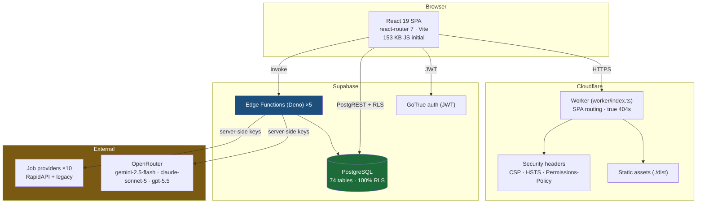
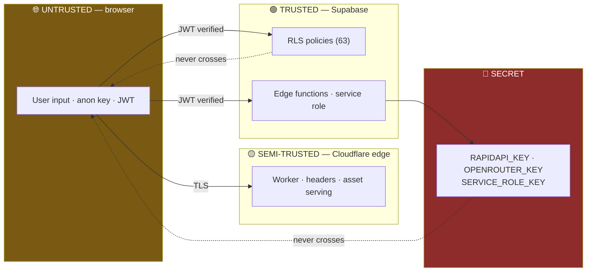
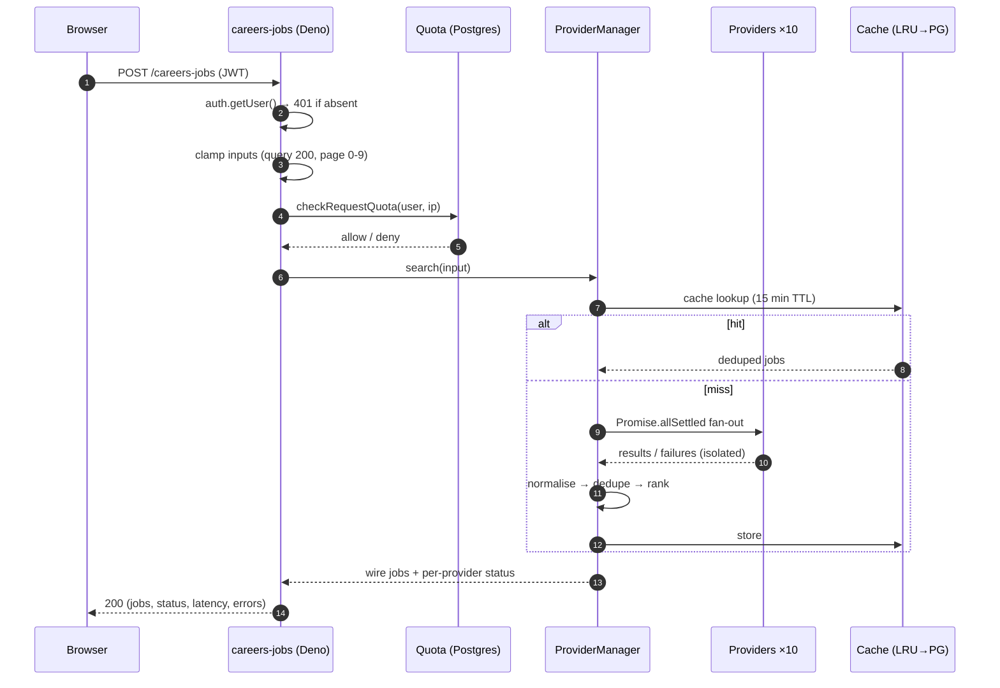
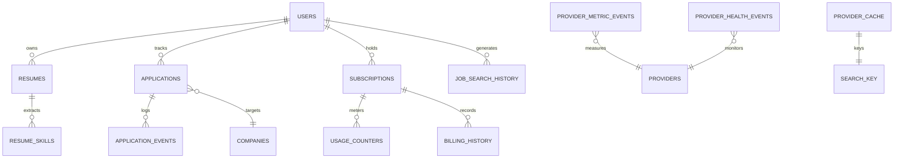
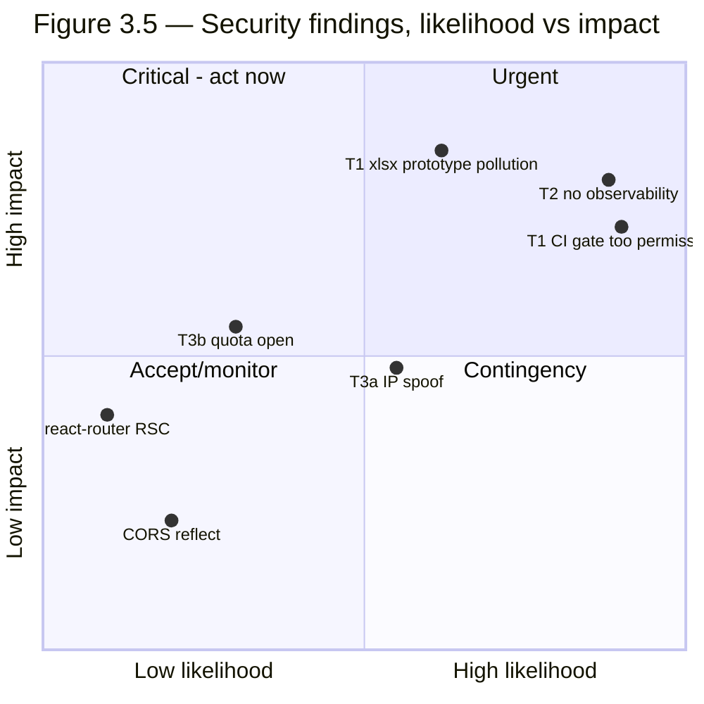
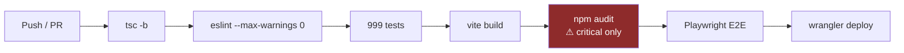

# FinatriX — Product Audit
## Volume 3 of 5 · Technical Architecture & Security

**Date:** 25 July 2026 · **Classification:** Board / Investor confidential · **CONTAINS SECURITY FINDINGS**
**Evidence standard:** **✓ Verified** · **⚠ Assumption**. Never mixed.

> **Handling note.** §5 documents unremediated security findings. Restrict distribution accordingly.
> No finding below was exploited — all were identified by source inspection, documentation review, or
> passive observation. No authentication was bypassed and no production data was modified.

---

## Executive summary of this volume

The technical foundation is the strongest asset FinatriX has. Measured against seed-stage norms it is
an outlier: **74 tables with 100% row-level-security coverage ✓**, **999 passing tests ✓**, a CI
pipeline that gates on type-checking, zero-warning linting, tests, build and E2E ✓, and a Content
Security Policy using **script hashes rather than `unsafe-inline` ✓**.

Three material weaknesses offset this:

| # | Weakness | Severity |
|:--:|---|:--:|
| **T1** | Two **high**-severity production dependency vulnerabilities ship to users; CI gates only on `critical`, so they pass silently | 🔴 S1 |
| **T2** | **Zero runtime observability** — no APM, no error tracking, no alerting. Production failures are invisible | 🔴 S2 |
| **T3** | Per-IP rate limiting is **trivially bypassable**; the quota store degrades **open** | 🟠 S2 |

---

## 1 · System Architecture

### 1.1 Topology ✓


*Figure 3.1 — System topology. Sources: `wrangler.jsonc` ✓, `supabase/functions/` ✓, live headers ✓.*

**Architectural assessment ⚠:** this is a well-chosen stack for the stage. Edge-hosted static
delivery, a managed Postgres with RLS as the primary authorisation boundary, and Deno edge functions
as the only holder of privileged secrets. The critical property — **no provider or AI key is ever
reachable from the browser** ✓ — is correctly enforced: all external calls originate in edge
functions.

### 1.2 Trust boundaries ✓


*Figure 3.2 — Trust boundaries ✓. Secrets are read only at edge-function composition roots.*

### 1.3 Job-ingestion pipeline ✓


*Figure 3.3 — Search request lifecycle ✓. `allSettled` guarantees one provider cannot fail the batch.*

**Strength ✓:** fault isolation is correct by construction. Every provider failure is converted to a
value, not a rejection; parsers fail *closed* (unknown shape → empty list → provider marked
unhealthy) rather than corrupting results.

---

## 2 · Frontend

| Dimension | Finding | Mark |
|---|---|:--:|
| Stack | React 19.2, react-router 7, Vite, TypeScript strict | ✓ |
| Scale | 279 TS/TSX files · 40,683 LOC | ✓ |
| Code splitting | 23 route-scoped chunks on `/careers/jobs` alone | ✓ |
| Initial JS | 153 KB transferred · 484 KB total · **budget guard enforced in CI** | ✓ |
| Third-party requests | **Zero** — no CDN, no analytics vendor, no font host | ✓ |
| Console hygiene | **0 errors** on landing and authenticated pages | ✓ |
| Design tokens | 111 CSS custom properties (see Vol 2 §4) | ✓ |

**Zero third-party requests is a notable privacy and security property** ✓ — it means the CSP's
`default-src 'self'` is honest, there is no vendor supply-chain exposure in the browser, and no data
leaks to third parties by default.

**⚠ Observation — possible over-eager chunk loading.** `exports`, `companyIntelligence` and
`companyIntelUser` chunks load on the Job Search route, where none is visibly required. *Not
confirmed as waste — they may be legitimately imported by a shared module. Worth one profiling pass.*

---

## 3 · Backend & API

### 3.1 Edge functions ✓

| Function | Purpose | Auth |
|---|---|:--:|
| `careers-jobs` | Multi-provider job aggregation | JWT ✓ |
| `careers-ai` | LLM enrichment (multi-model fallback) | JWT ✓ |
| `careers-email` | Transactional email | JWT ✓ |
| `analytics-collect` | Privacy-first analytics ingest | — |
| `_shared` | Shared utilities | n/a |

### 3.2 API design assessment ✓

The provider abstraction is the best-engineered subsystem reviewed. A single `JobProvider` interface
is implemented by ten providers; no provider-specific logic exists anywhere outside a provider class.
Adding a provider is a one-file change.

| Property | Evidence | Mark |
|---|---|:--:|
| Input validation | Every field clamped (`query` 200 chars, `page` 0–9, `terms` ≤18) | ✓ |
| Fault isolation | `Promise.allSettled`; failures become values | ✓ |
| Timeout | 12 s hard per provider via `AbortController` | ✓ |
| Retry | Bounded; **never** retries 429 (would burn paid quota) | ✓ |
| Degradation | Falls back to in-memory stores if service-role client fails | ✓ |
| Error taxonomy | Typed `ErrorKind` union, not string sniffing | ✓ |

**⚠ Inconsistency (S3).** `CAREERS_PROVIDER_RETRIES` is documented as "config-tunable; 0 disables
retries", but is only read by the legacy fetch path. The six newer providers use
`BaseProvider.fetchJson`, which **hard-codes** one retry. Setting the variable to `0` silently does
nothing for them. ✓ *Verified by grep.*

---

## 4 · Database

### 4.1 Posture ✓ — the standout result

| Metric | Value |
|---|---|
| Tables | **74** |
| Tables with RLS enabled | **74 (100%)** |
| RLS policies | 63 |
| Indexes | 89 |
| Schema files | 9 (phased migrations) |

**100% RLS coverage across 74 tables is rare and is the single strongest security signal in this
audit** ✓. Combined with `set search_path = ''` on functions (blocking object-resolution hijacking ✓)
and privileged RPCs revoked from `public`/`anon`/`authenticated` ✓, the data layer is built to a
standard well above stage norms.


*Figure 3.4 — Core entity relationships (representative subset of 74 tables) ✓.*

### 4.2 Caching ✓

Two-tier: per-isolate LRU → Postgres (`provider_cache`), 15-minute TTL for searches, prefix
invalidation, deterministic order-independent keys.

**Correctness property worth noting ✓:** the cache key excludes user skills, and skill-matching is
applied *after* cache read — so no per-user data can leak between cache consumers. That is a
deliberate, correct design decision.

> **Correction to a common assumption.** There is **no Cloudflare cache** in the job-search path.
> `careers-jobs` is a Supabase edge function; Cloudflare fronts only static assets. Any roadmap item
> premised on "tuning the Cloudflare cache for search" is premised on an architecture that does not
> exist. ✓

---

## 5 · Security — OWASP Top 10 (2021)

| # | Category | Assessment | Mark |
|---|---|---|:--:|
| A01 | Broken access control | 🟢 **Strong** — 100% RLS, 63 policies, service-role-only writes. One P1 view-RLS bypass found and **fixed** this engagement | ✓ |
| A02 | Cryptographic failures | 🟢 HSTS preload; TLS enforced; no secrets client-side | ✓ |
| A03 | Injection | 🟢 No string-built SQL; parameterised RPC; `search_path` pinned; CSP blocks inline JS | ✓ |
| A04 | Insecure design | 🟡 Sound overall; quota **degrades open** (§5.3) | ✓ |
| A05 | Security misconfiguration | 🟡 Headers excellent; **CORS reflects any origin** (§5.4) | ✓ |
| A06 | **Vulnerable components** | 🔴 **2 high-severity prod vulns shipped** (§5.1) | ✓ |
| A07 | Auth failures | 🟢 JWT enforced; 401 without session; no credential handling client-side | ✓ |
| A08 | Integrity failures | 🟢 CSP with script **hashes**; no third-party scripts | ✓ |
| A09 | **Logging & monitoring** | 🔴 **No APM, no error tracking, no alerting** (§5.2) | ✓ |
| A10 | SSRF | 🟢 No user-controlled outbound URLs; provider hosts are constants | ✓ |

### 5.1 🔴 T1 — Vulnerable production dependencies ✓

`npm audit --omit=dev` reports **3 vulnerabilities (2 high, 1 low)** in shipped code:

| Package | Severity | Advisory | Fix available? |
|---|:--:|---|:--:|
| **`xlsx`** (SheetJS) | **HIGH** | Prototype Pollution ([GHSA-4r6h-8v6p-xvw6](https://github.com/advisories/GHSA-4r6h-8v6p-xvw6)) + ReDoS ([GHSA-5pgg-2g8v-p4x9](https://github.com/advisories/GHSA-5pgg-2g8v-p4x9)) | ❌ **No** (range `*`) |
| **`react-router`** | **HIGH** | RSC-mode CSRF bypass ([GHSA-qwww-vcr4-c8h2](https://github.com/advisories/GHSA-qwww-vcr4-c8h2)) | ✅ Yes |
| `dompurify` | LOW | `CUSTOM_ELEMENT_HANDLING` sanitiser bypass ([GHSA-c2j3-45gr-mqc4](https://github.com/advisories/GHSA-c2j3-45gr-mqc4)) | ✅ Yes |

**`xlsx` is the material one.** The advisory range is `*` with **no fixed version on npm** — SheetJS
distributes patched builds only from its own registry. Prototype pollution reached via
attacker-controlled input is a serious class, and this application **parses user-uploaded
spreadsheets** (`src/tools/lib/exporters.ts` ✓), which is precisely the exposed path.

**⚠ Exploitability note, stated for fairness:** the `react-router` advisory is specific to **RSC
mode**, which this client-rendered SPA does not use — real-world exposure is likely low. The `xlsx`
issue has no such mitigating context.

**🔴 The systemic finding is the gate, not the packages.** CI runs:

```
npm audit --omit=dev --audit-level=critical
```

Because the threshold is `critical`, **both high-severity vulnerabilities pass CI green** ✓. The
pipeline is reporting safety it is not checking.

| Action | Pri | Effort |
|---|:--:|:--:|
| Lower CI threshold to `--audit-level=high` | P1 | S |
| Upgrade `react-router` and `dompurify` | P1 | S |
| Decide on `xlsx`: migrate to `exceljs`, or pin SheetJS's patched build from its own registry | P1 | M |

### 5.2 🔴 T2 — No runtime observability ✓

No Sentry, no APM, no error-tracking, no alerting dependency exists anywhere in the project ✓.
Observability is limited to `console.info` structured logs inside edge functions.

**Consequence:** a production failure — a provider outage, a spike in 500s, a broken deploy — is
detected only when a user reports it. There is no mean-time-to-detect. For a platform intending to
serve real job seekers at a decisive moment in their lives, this is the highest-impact operational
gap in the audit.

*Positive note ✓:* the structured logs that do exist are well designed — secret-free, PII-free,
carrying country/counts/latency only. The instrumentation discipline exists; the destination does not.

### 5.3 🟠 T3 — Rate limiting weaknesses ✓

**(a) Per-IP quota is bypassable.** Client IP is derived as:

```
CF-Connecting-IP  →  x-forwarded-for  →  'unknown'
```

`careers-jobs` runs on **Supabase Edge, not behind Cloudflare** ✓, so nothing strips or sets
`CF-Connecting-IP`. A caller can supply and rotate an arbitrary value, defeating the per-IP dimension
entirely. Per-*user* quota and JWT auth still bound the damage, so this is **S2, not S1**.

**(b) Quota degrades open.** On a quota-store outage the limiter allows traffic through — a
deliberate availability-over-protection trade-off, documented in source ✓. Defensible, but it means a
database incident silently removes abuse protection. **This is only acceptable with alerting — which
does not exist (§5.2).** The two findings compound.

### 5.4 🟡 CORS reflects any well-formed origin ✓

`corsFor()` reflects any valid http(s) origin rather than an allowlist. The reasoning documented in
source is sound — the endpoint authenticates by Bearer JWT and uses **no cookies**, so there are no
ambient credentials for a cross-site request to ride on, and CSRF is not enabled. **Assessed as
acceptable**, and tightenable via `CAREERS_ALLOWED_ORIGINS` if policy requires.

### 5.5 Security posture summary



---

## 6 · CI/CD & Developer Experience

### 6.1 Pipeline ✓


*Figure 3.6 — CI pipeline ✓. The audit stage is the weak link (§5.1).*

**This is a genuinely strong pipeline for the stage** — zero-warning lint and real browser E2E are
both above the seed-stage norm.

| Dimension | Finding | Mark |
|---|---|:--:|
| Type safety | `tsc -b` gates every change | ✓ |
| Lint | `--max-warnings 0` — no warning debt tolerated | ✓ |
| Tests | 999 across 73 files, all passing | ✓ |
| E2E | Playwright Chromium in CI | ✓ |
| Perf budget | Landing JS budget guard enforced | ✓ |
| Dependency gate | **`critical` only — misses high** | 🔴 |
| Deploy | `wrangler deploy` to Cloudflare | ✓ |
| Migrations | **Applied manually via `psql`** — not automated | ⚠ |

**⚠ Migration risk.** Schema files carry an instruction to run `psql -f`. There is no migration
runner, no version table, and no drift detection observed. At 74 tables across 9 files this is
already fragile; it is the kind of process that produces an environment mismatch during an incident.

### 6.2 Test coverage shape ✓ — one caveat worth recording

999 tests is a strong number, but this engagement demonstrated that **test count is not test
validity**: the six job-provider adapters had passing contract tests written against *invented*
fixtures, so the suite was green while all three Fantastic-family providers would have failed 100% of
live requests ✓ (remediated; see the Production Readiness Report).

**⚠ Recommendation:** audit fixtures for provenance. A fixture that was authored rather than captured
tests the author's assumption, not the integration.

---

## 7 · Scalability ⚠

*All estimates in this section are assumptions — no load test has been run.*

| Layer | Headroom | Constraint |
|---|---|---|
| Static delivery | Very high | Cloudflare edge; assets cached (`cf-cache-status: HIT` ✓) |
| Edge functions | Moderate | Per-isolate state (LRU, burst limiter) does not share across isolates ⚠ |
| Postgres | Moderate | 89 indexes ✓; `provider_cache` and `provider_quota` will need pruning cron ✓ (functions exist) |
| Job providers | **Low — hard cost ceiling** | Paid per request **and per returned job** ✓ |
| AI | Moderate | Multi-model fallback + caching + token accounting ✓ |

**The binding constraint is provider cost, not compute** ✓. Vendor quotas are dual-dimension
(25,000 requests / 200,000 job credits on the tier documented), and job credits are the tighter
budget. The system currently tracks only the request dimension — meaning the dashboard will show
healthy quota until the *actual* limit is hit. Fixing this precedes any scale event.

---

## 8 · Consolidated Technical Recommendations

| ID | Recommendation | Problem | Sev | Pri | Effort | Owner | Acceptance criteria |
|---|---|---|:--:|:--:|:--:|---|---|
| T-1 | Raise CI audit gate to `high`; fail the build | 2 high vulns pass CI | S1 | **P0** | S | DevOps | CI red on high |
| T-2 | Resolve `xlsx` — migrate or pin patched build | Prototype pollution on user-uploaded files | S1 | **P0** | M | Frontend | 0 high prod vulns |
| T-3 | Add error tracking + alerting (Sentry/equiv.) | No MTTD; failures invisible | S2 | **P0** | M | DevOps | Alert fires on 5xx spike |
| T-4 | Upgrade `react-router`, `dompurify` | Known advisories | S2 | P1 | S | Frontend | Advisories cleared |
| T-5 | Trust platform client IP; ignore `CF-Connecting-IP` | Per-IP quota bypassable | S2 | P1 | S | Backend | Spoofed header ignored |
| T-6 | Track `x-ratelimit-jobs-remaining` | Binding quota invisible | S2 | P1 | S | Backend | Both dimensions on dashboard |
| T-7 | Adopt a migration runner + version table | Manual `psql`, no drift detection | S2 | P1 | M | Backend | Migrations run in CI |
| T-8 | Fix `analytics_event_counts_daily` view RLS | Same P1 bypass pattern | S2 | P1 | S | Backend | `security_invoker = true` |
| T-9 | Alert on quota-store failure (open-degrade) | Silent loss of abuse protection | S3 | P2 | S | DevOps | Alert on fallback |
| T-10 | Audit test fixtures for provenance | Invented fixtures hid total failure | S3 | P2 | M | QA | Fixtures captured, not authored |
| T-11 | Make `CAREERS_PROVIDER_RETRIES` effective or remove | Silently inert for 6 providers | S3 | P3 | S | Backend | Var works or is deleted |
| T-12 | Profile eager chunk loading on Jobs route | Possibly unnecessary chunks | S4 | P3 | S | Frontend | Only required chunks load |

---

## Appendix — Volume 3 Evidence Index

| ID | Claim | Method |
|---|---|---|
| E3-01 | 74 tables / 74 RLS / 63 policies / 89 indexes | grep over `supabase/*.sql` |
| E3-02 | 2 high + 1 low prod vulns | `npm audit --omit=dev --json` |
| E3-03 | CI gates on `critical` only | `.github/workflows/ci.yml` |
| E3-04 | `xlsx` unfixable, range `*` | audit `fixAvailable: false` |
| E3-05 | No observability dependency | dependency scan for sentry/APM → 0 |
| E3-06 | IP from `CF-Connecting-IP` first | `careers-jobs/index.ts:547` |
| E3-07 | Quota degrades open | source comment |
| E3-08 | CSP uses script hashes | live response headers |
| E3-09 | Zero third-party requests | network capture, authenticated route |
| E3-10 | 23 chunks on `/careers/jobs` | network capture |
| E3-11 | 999 tests pass | `npm test` |
| E3-12 | No Cloudflare cache in search path | `wrangler.jsonc` + `ProviderCache.ts` |
| E3-13 | Migrations applied manually | header comment in schema files |
| E3-14 | 5 edge functions | `ls supabase/functions/` |

---

**End of Volume 3.** → Volume 4: Careers Platform & Competitive Analysis.
