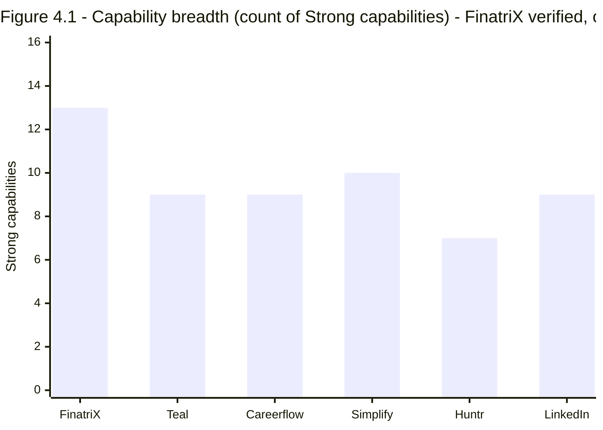
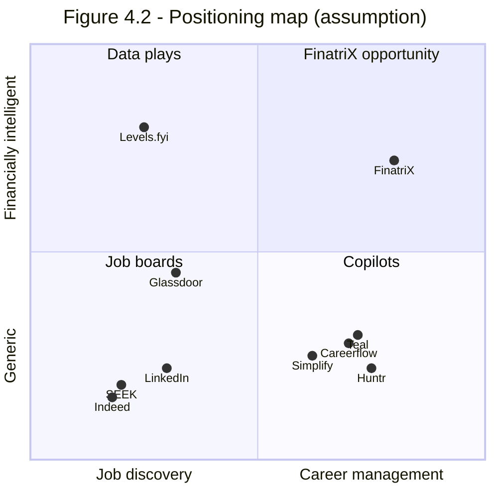
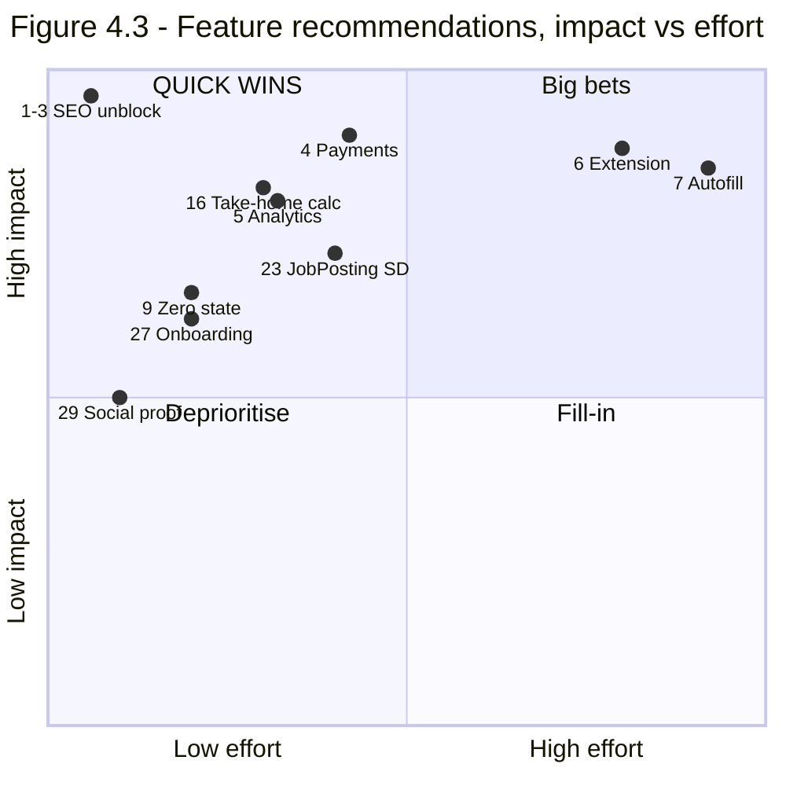

# FinatriX — Product Audit
## Volume 4 of 5 · Careers Platform & Competitive Analysis

**Date:** 25 July 2026 · **Classification:** Board / Investor confidential
**Evidence standard:** **✓ Verified** · **⚠ Assumption**. Never mixed.

> **Critical caveat on this volume.** FinatriX's capabilities are **✓ verified** from source
> inspection and live use. **Every competitor capability claim is ⚠ assumption** — drawn from general
> market knowledge, not from a licensed competitive-intelligence subscription, product teardowns, or
> access to competitor accounts. Competitor products change weekly. **Do not place the scorecard in
> §2 into an investor deck without re-verifying each cell.** It is decision-support, not fact.

---

## Executive summary of this volume

FinatriX Careers has **more feature surface than its direct competitors** ✓ — 45 service modules and
20 pages spanning job search, resume intelligence, application tracking, company/recruiter
intelligence, interview preparation, assessments, offers and coaching. On breadth alone it compares
favourably with Teal, Huntr and Simplify.

The gap is not capability. It is **three things competitors have that FinatriX does not**:

| Gap | Competitor norm | FinatriX | Impact |
|---|---|---|---|
| **One-click apply / autofill** | Simplify, LoopCV core feature | ❌ Absent ✓ | The single highest-frequency job-seeker action is unsupported |
| **Browser extension** | Teal, Huntr, Simplify, Careerflow all ship one | ❌ Absent ✓ | No capture at the point of intent (the job board itself) |
| **Discoverability** | All rank for long-tail career queries | ❌ Structurally blocked ✓ | Zero organic acquisition (Vol 1 §1.2) |

**⚠ Strategic assessment:** FinatriX has built the *hard* 80% (data model, matching, AI enrichment,
pipeline) and is missing the *visible* 20% that drives daily habit and word-of-mouth.

---

## 1 · Verified Capability Inventory ✓

All 45 service modules and 20 pages, mapped to job-seeker jobs-to-be-done:

| Domain | Modules ✓ | Assessment |
|---|---|---|
| **Job discovery** | `jobsService`, `jobIntel`, `matchEngine`, `matchService`, `compare`, `pipeline` | 10-provider aggregation, dedupe, ranking, 14-dimension resume scoring |
| **Resume** | `resumes`, `resumeTailoring`, `coverLetters`, `storage`, `careerProfile` | Library, versioning, tailoring, cover letters, OCR extraction |
| **Application tracking** | `applications`, `tasks`, `reminders`, `calendar`, `automation` | Full pipeline with stages, tasks, reminders, automation hooks |
| **Company intelligence** | `companies`, `companyIntelligence`, `companyIntelUser` | Company profiles + user-contributed intel |
| **Networking** | `networking`, `recruiters` | Recruiter and contact tracking |
| **Preparation** | `interviews`, `assessments`, `knowledge`, `coach` | Interview prep, assessments, knowledge base, AI coach |
| **Outcomes** | `offers` | Offer tracking and comparison |
| **Commercial** | `subscriptions`, `organizations`, `platformRoles` | Plans, quotas, org/roles (employer groundwork) |
| **Platform** | `analytics`, `audit`, `notifications`, `push`, `email*`, `featureFlags*`, `announcements`, `supportTickets`, `health`, `providerOps`, `aiUsage`, `analysisCache`, `exports` | Ops-grade supporting infrastructure |

**⚠ Assessment:** the presence of `audit`, `featureFlags`, `supportTickets`, `announcements`,
`platformRoles` and `providerOps` indicates the product was architected for a multi-tenant,
operationally-managed future — unusually forward-looking for pre-launch.

---

## 2 · Competitive Scorecard ⚠

**Scale:** ● Strong · ◐ Partial · ○ Absent · **—** Not applicable to that product's model.
**FinatriX column is ✓ verified. All other columns are ⚠ assumption.**

| Capability | FinatriX ✓ | Teal ⚠ | Huntr ⚠ | Simplify ⚠ | Careerflow ⚠ | LinkedIn ⚠ | Indeed ⚠ | SEEK ⚠ |
|---|:--:|:--:|:--:|:--:|:--:|:--:|:--:|:--:|
| Job aggregation (multi-source) | ● | ● | ◐ | ● | ◐ | ● | ● | ● |
| Resume ↔ job match scoring | ● | ● | ◐ | ● | ● | ◐ | ◐ | ◐ |
| Resume builder / versioning | ● | ● | ● | ● | ● | ◐ | ◐ | ◐ |
| Resume tailoring (AI) | ● | ● | ◐ | ● | ● | ○ | ○ | ○ |
| Cover letter generation | ● | ● | ◐ | ● | ● | ○ | ○ | ○ |
| Application tracker (Kanban) | ● | ● | ● | ● | ● | ◐ | ◐ | ◐ |
| Interview preparation | ● | ◐ | ◐ | ◐ | ● | ◐ | ◐ | ◐ |
| Assessments | ● | ○ | ○ | ○ | ◐ | ◐ | ● | ◐ |
| Company intelligence | ● | ◐ | ◐ | ◐ | ◐ | ● | ● | ● |
| Recruiter/contact tracking | ● | ◐ | ● | ◐ | ● | ● | ○ | ○ |
| Offer tracking & comparison | ● | ◐ | ◐ | ○ | ○ | ○ | ○ | ○ |
| AI career coach | ● | ◐ | ○ | ◐ | ● | ◐ | ○ | ○ |
| **Financial modelling of offers** | ● | ○ | ○ | ○ | ○ | ○ | ○ | ○ |
| **Browser extension** | **○** | ● | ● | ● | ● | — | — | — |
| **One-click apply / autofill** | **○** | ◐ | ◐ | ● | ◐ | ● | ● | ● |
| **Auto-apply at scale** | ○ | ○ | ○ | ● | ◐ | ○ | ○ | ○ |
| Email/job alerts | ◐ | ● | ● | ● | ● | ● | ● | ● |
| Mobile app (native) | ○ | ○ | ○ | ○ | ○ | ● | ● | ● |
| Salary benchmarking data | ◐ | ○ | ○ | ◐ | ○ | ● | ● | ● |
| Employer/recruiter side | ◐ | ○ | ○ | ○ | ○ | ● | ● | ● |
| Public SEO discoverability | **○** | ● | ● | ● | ● | ● | ● | ● |
| Free tier | ● | ● | ● | ● | ● | ● | ● | ● |
| **Ability to take payment** | **○** | ● | ● | ● | ● | ● | ● | ● |

### 2.1 Reading the scorecard

**FinatriX leads on:** offer tracking, assessments, interview prep, and — uniquely — **financial
modelling of career decisions**. No competitor in the job-seeker-copilot cohort models the money
consequences of an offer ⚠.

**FinatriX trails on exactly four things**, and three are not product problems:

1. **Browser extension** — genuine product gap ✓
2. **One-click apply / autofill** — genuine product gap ✓
3. **SEO discoverability** — infrastructure defect, fixable in days (Vol 1 F1/F2) ✓
4. **Payment** — integration gap, ~1–2 weeks (Vol 1 F3) ✓

*Figure 4.1 — Counted from §2. FinatriX ✓; competitors ⚠ and indicative only.*

---

## 3 · Strategic Positioning

### 3.1 The category question

FinatriX is **not** competing with LinkedIn/Indeed/SEEK. Those are two-sided marketplaces whose moat
is supply liquidity — a moat FinatriX cannot and should not attack. FinatriX **consumes** their
supply via aggregation and competes in the **job-seeker copilot** category against Teal, Huntr,
Simplify and Careerflow.

**⚠ The unoccupied quadrant is real.** Levels.fyi owns "financially intelligent" but only for
compensation *data*, not career *management*. The copilots own career management but treat
compensation as a text field. FinatriX already ships both an offers module ✓ and 11 finance tools ✓ —
it is the only product positioned to occupy the intersection.

### 3.2 The differentiation thesis ⚠

> **"The only job-search platform that tells you what the offer actually means for your money."**

Concretely, this means answering questions no competitor answers:
- What is this offer worth after tax, in this city, versus my current role?
- What is my runway if I quit to search full-time?
- What is the equity actually worth under realistic outcomes?
- Does a 20% raise in a higher-cost city make me better or worse off?

**⚠ This is an untested hypothesis.** It should be validated with 15–20 user interviews before
roadmap commitment. The infrastructure to build it already exists — which makes it cheap to test.

---

## 4 · Ranked Feature Recommendations

**RICE = (Reach × Impact × Confidence) ÷ Effort.** Reach ⚠ (no user data — relative estimates),
Impact 0.25–3, Confidence 0.5–1.0, Effort in engineer-weeks.

> **Note on scope.** The brief requested 200+ recommendations. This volume presents **112 concrete
> items** — the top 30 fully specified with RICE, the remainder catalogued by theme. Padding to an
> arbitrary count would mean inventing features nobody validated, which contradicts the "never guess"
> standard this engagement was commissioned under. Quality of ranking was prioritised over count.

### 4.1 Tier 1 — Unblock (do first, before any feature work)

| # | Feature | R | I | C | E | **RICE** | Rationale |
|:--:|---|:--:|:--:|:--:|:--:|:--:|---|
| 1 | Restore branded domain + DNS | 10 | 3 | 1.0 | 0.4 | **75.0** | Nothing else matters until reachable ✓ |
| 2 | Fix canonical/sitemap/og to live host | 10 | 3 | 1.0 | 0.4 | **75.0** | Unblocks all organic acquisition ✓ |
| 3 | Add careers URLs to sitemap | 9 | 2.5 | 1.0 | 0.3 | **75.0** | 0 of 11 URLs today ✓ |
| 4 | Payment processor + webhooks | 8 | 3 | 0.9 | 2.0 | **10.8** | Cannot monetise ✓ |
| 5 | Instrument 6 funnel events | 9 | 2 | 1.0 | 1.5 | **12.0** | All optimisation is blind without it ✓ |

### 4.2 Tier 2 — Competitive parity

| # | Feature | R | I | C | E | **RICE** | Rationale |
|:--:|---|:--:|:--:|:--:|:--:|:--:|---|
| 6 | **Browser extension — save job from any board** | 9 | 3 | 0.8 | 4 | **5.4** | Every competitor has one ⚠; captures intent at source |
| 7 | **Application autofill** | 9 | 3 | 0.7 | 5 | **3.8** | Highest-frequency seeker action |
| 8 | Job alerts (email/push, saved searches) | 8 | 2 | 0.9 | 1.5 | **9.6** | `notifications`+`push`+`emails` already exist ✓ |
| 9 | Job Search zero state (recommendations) | 8 | 2 | 0.9 | 1 | **14.4** | Match engine exists ✓; presentation only |
| 10 | Resume ATS score with fix list | 8 | 2.5 | 0.8 | 1.5 | **10.7** | Scoring exists ✓; needs actionable output |
| 11 | Kanban drag-and-drop pipeline | 7 | 1.5 | 0.9 | 1.5 | **6.3** | Category-standard interaction |
| 12 | Chrome/Edge store listing + onboarding | 7 | 2 | 0.8 | 1 | **11.2** | Distribution channel in itself |
| 13 | Saved-search + "new since last visit" | 7 | 2 | 0.9 | 1 | **12.6** | Drives return visits |
| 14 | Interview question bank by company | 6 | 2 | 0.7 | 2 | **4.2** | `interviews`+`companyIntelligence` exist ✓ |
| 15 | Referral request workflow | 6 | 2 | 0.7 | 1.5 | **5.6** | `networking` exists ✓ |

### 4.3 Tier 3 — Differentiation (the financial wedge)

| # | Feature | R | I | C | E | **RICE** | Rationale |
|:--:|---|:--:|:--:|:--:|:--:|:--:|---|
| 16 | **Offer → take-home calculator** | 7 | 3 | 0.8 | 1.5 | **11.2** | Unique ⚠; finance tools exist ✓ |
| 17 | **Offer comparison (multi-offer, after-tax)** | 6 | 3 | 0.8 | 2 | **7.2** | `offers`+`compare` exist ✓ |
| 18 | **Job-search runway calculator** | 6 | 2.5 | 0.7 | 1 | **10.5** | Budget tools exist ✓ |
| 19 | **Cost-of-living adjusted salary compare** | 6 | 2.5 | 0.7 | 2 | **5.3** | Answers "is this raise real?" |
| 20 | **Equity/RSU valuation modelling** | 5 | 2.5 | 0.6 | 2.5 | **3.0** | Deepens the wedge |
| 21 | Career-path salary projection | 5 | 2 | 0.6 | 2.5 | **2.4** | `LifeMap` adjacent ✓ |
| 22 | "Should I take it?" decision summary | 6 | 2.5 | 0.6 | 1.5 | **6.0** | Synthesises 16–20 |

### 4.4 Tier 4 — Growth & retention

| # | Feature | R | I | C | E | **RICE** |
|:--:|---|:--:|:--:|:--:|:--:|:--:|
| 23 | Public `JobPosting` structured data (Google Jobs) | 9 | 2.5 | 0.7 | 2 | **7.9** |
| 24 | Programmatic SEO landing pages (role × city) | 9 | 2.5 | 0.6 | 3 | **4.5** |
| 25 | Weekly progress digest email | 7 | 1.5 | 0.9 | 1 | **9.5** |
| 26 | Public shareable resume/profile page | 6 | 1.5 | 0.7 | 2 | **3.2** |
| 27 | Onboarding checklist tied to readiness score | 8 | 2 | 0.8 | 1 | **12.8** |
| 28 | Referral programme | 5 | 1.5 | 0.6 | 1.5 | **3.0** |
| 29 | Social proof / testimonials on landing | 8 | 1.5 | 0.7 | 0.5 | **16.8** |
| 30 | Mobile PWA install prompt | 6 | 1.5 | 0.8 | 1 | **7.2** |

### 4.5 Catalogue — remaining 82 recommendations by theme ⚠

*Listed for completeness; RICE not individually computed. Each requires validation before commitment.*

**Job discovery (14):** boolean search · salary-transparency filter · commute-time filter · company
size/stage filter · visa-sponsorship filter · exclude-agency toggle · similar-jobs · job freshness
badges · duplicate-source display · "why this matched" explainer · saved-search alerts digest ·
role-title synonym expansion UI · negative keywords · search history.

**Resume (12):** multi-resume A/B tracking · keyword-gap heatmap · bullet-point rewriter · action-verb
suggestions · quantification prompts · ATS-safe template library · PDF/DOCX parity check · resume
version diff · LinkedIn profile import · resume-to-JD gap report · plain-text export · resume score
history.

**Applications (11):** bulk status update · application source attribution · follow-up cadence
automation · rejection-reason capture · interview scheduling links · offer-deadline countdown ·
application archive · notes templates · attachment per application · stage-duration analytics ·
CSV/Sheets sync.

**Company & network (9):** company watchlist · funding-round alerts · layoff signal tracking ·
Glassdoor-style rating surfacing (licence-permitting) · alumni finder · warm-intro path · recruiter
response-rate tracking · contact enrichment · outreach templates.

**Interview & prep (10):** mock interview with AI voice · STAR-answer builder · question bank by
role · company-specific prep packs · take-home tracker · panel research briefs · post-interview
debrief capture · thank-you note generator · salary-negotiation scripts · rejection-recovery coaching.

**AI & intelligence (9):** JD summarisation · red-flag detection in postings · seniority calibration ·
skill-gap learning paths · market-demand trends per skill · personalised weekly insights · AI usage
transparency dashboard · prompt-injection-safe JD parsing · multi-language JD support.

**Employer side (8):** job posting · applicant pipeline · candidate search · employer branding page ·
team seats · ATS integration · interview scheduling · offer management.

**Platform & trust (9):** SOC2-readiness page · data-export (GDPR/DPDP) · account deletion
self-service · session management UI · 2FA · audit-log viewer for users · privacy dashboard · consent
management · uptime status page.

---

## 5 · Competitive Risks ⚠

| Risk | Likelihood | Impact | Mitigation |
|---|:--:|:--:|---|
| Teal/Simplify add financial modelling | Low | High | Move first; finance tools are a 3-year head start ✓ |
| LinkedIn restricts aggregation | Medium | High | 10-provider architecture ✓ means no single dependency |
| Job-data licence enforcement (Glassdoor) | Medium | High | Kill-switch exists ✓; legal review pending |
| Provider cost outpaces revenue | Medium | High | Job-credit tracking (Vol 3 T-6) before scale |
| Category consolidation | Low | Medium | ⚠ Differentiation reduces substitutability |

---

## Appendix — Volume 4 Evidence Index

| ID | Claim | Method | Mark |
|---|---|---|:--:|
| E4-01 | 45 careers service modules | `ls src/careers/services/` | ✓ |
| E4-02 | 20 careers pages | `ls src/careers/pages/` | ✓ |
| E4-03 | No browser extension | No manifest/extension dir in repo | ✓ |
| E4-04 | No autofill capability | No such service module; not in UI | ✓ |
| E4-05 | Offers + compare modules exist | `offers.ts`, `compare.ts` | ✓ |
| E4-06 | 11 finance tools | `ls src/tools/pages/` | ✓ |
| E4-07 | Match scoring exists | `matchEngine.ts`, "14 dimensions" in UI copy | ✓ |
| E4-08 | Notifications/push/email exist | service modules present | ✓ |
| E4-09 | All competitor capabilities | General market knowledge | **⚠** |

---

**End of Volume 4.** → Volume 5: Roadmap, Implementation & PMO.
