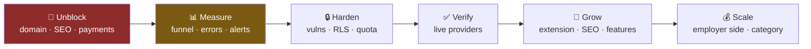
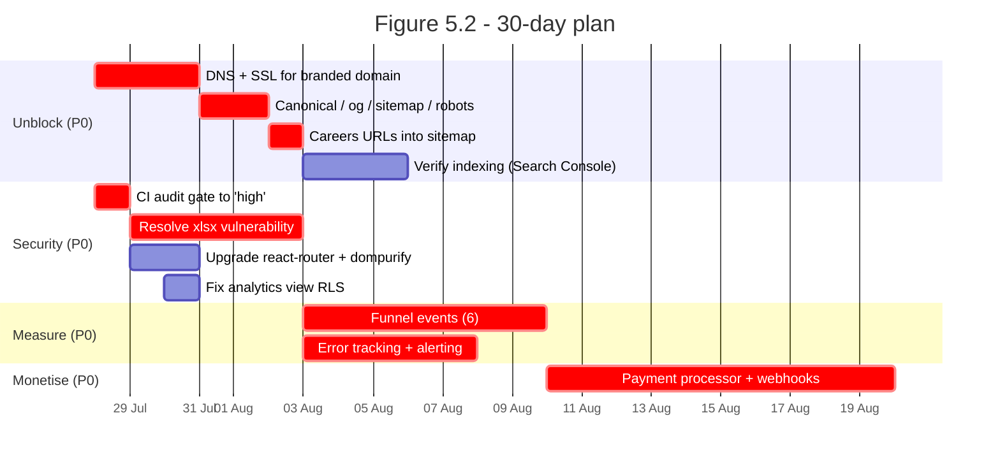
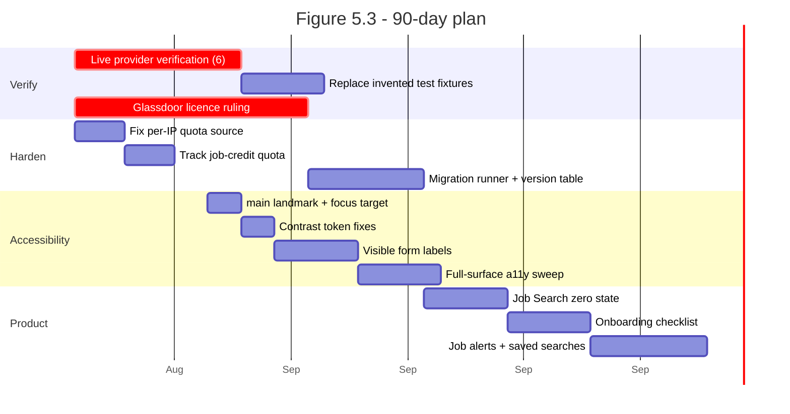
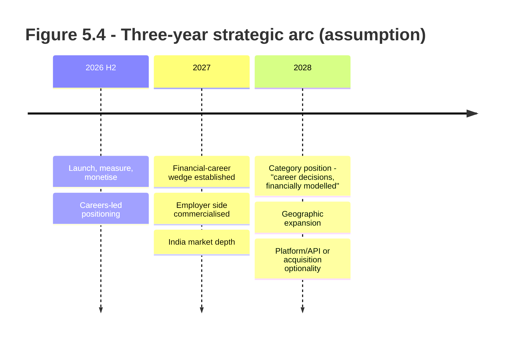
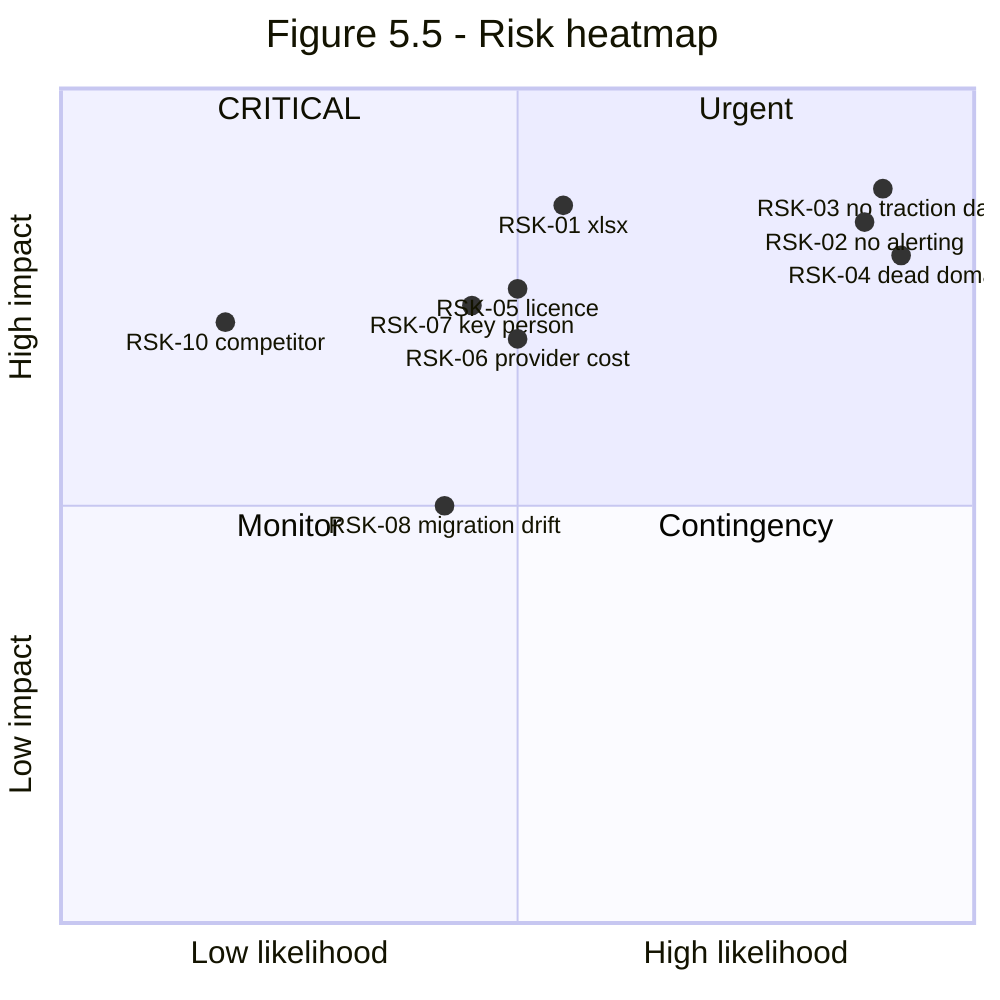

# FinatriX — Product Audit
## Volume 5 of 5 · Roadmap, Implementation & PMO

**Date:** 25 July 2026 · **Classification:** Board / Investor confidential
**Evidence standard:** **✓ Verified** · **⚠ Assumption**. Never mixed.

> **Costing caveat.** Every cost, duration and ROI figure in this volume is **⚠ assumption**. No
> access was provided to FinatriX's financials, payroll, burn rate, contracts, or team composition.
> Effort estimates are the auditor's judgement from code inspection. They are planning inputs to be
> re-based against the actual team, **not** a budget.
>
> **Blended engineering cost assumed at ⚠ US$5,000 per engineer-month.** Substitute your real figure;
> all monetary values scale linearly.

---

## 1 · Sequencing Logic

The order below is not preference — it is **dependency**. Three constraints force it:

1. **Nothing can be measured until analytics exists.** Every optimisation recommendation across
   Volumes 2–4 is currently a hypothesis (Vol 2 §6 ✓).
2. **Nothing can be acquired until the domain resolves.** Organic acquisition is structurally
   impossible, not weak (Vol 1 §1.2 ✓).
3. **Nothing can be monetised until checkout exists** (Vol 1 §3.2 ✓).

Building features before these three are fixed produces work that cannot be evaluated, found, or
paid for.

*Figure 5.1 — Dependency chain. Each stage gates the next.*

---

## 2 · 30-Day Plan — "Make it reachable, payable, measurable"

**Objective:** convert an unlaunched project into a launched, measurable product.
**⚠ Estimated effort: 6.5 engineer-weeks ≈ US$8,100.**

| ID | Task | Owner | Effort ⚠ | Acceptance criteria | Depends on |
|---|---|---|:--:|---|---|
| R1-01 | Restore DNS + SSL for branded domain | DevOps | 0.4 w | `finatrix.co` resolves, serves 200, valid cert | — |
| R1-02 | Point canonical/`og:url`/sitemap/robots at live host | Frontend | 0.4 w | 0 references to a non-resolving host | R1-01 |
| R1-03 | Add all careers URLs to sitemap | Frontend | 0.2 w | Careers routes present in `sitemap.xml` | R1-02 |
| R1-04 | Submit to Search Console; confirm indexing | Growth | 0.2 w | ≥1 page indexed | R1-02 |
| R1-05 | CI dependency gate → `--audit-level=high` | DevOps | 0.2 w | Build fails on high | — |
| R1-06 | Resolve `xlsx` (migrate or pin patched build) | Frontend | 1.0 w | 0 high prod vulns | R1-05 |
| R1-07 | Upgrade `react-router`, `dompurify` | Frontend | 0.4 w | Advisories cleared | R1-05 |
| R1-08 | `security_invoker` on analytics view | Backend | 0.2 w | Non-admin read returns 0 rows | — |
| R1-09 | Instrument 6 funnel events | Data | 1.5 w | signup/upload/search/save/apply/stage emit | — |
| R1-10 | Error tracking + alerting | DevOps | 1.0 w | Alert fires on 5xx spike | — |
| R1-11 | Payment processor + webhooks | Backend | 2.0 w | Test transaction completes; subscription activates | — |

**Exit criteria (all must be true):** branded domain live · ≥1 page indexed · 0 high prod vulns ·
funnel emitting · alerting live · one successful test payment.

---

## 3 · 90-Day Plan — "Prove the funnel"

**⚠ Estimated effort: 11 engineer-weeks ≈ US$13,750.**

| ID | Task | Owner | Effort ⚠ | Success metric |
|---|---|---|:--:|---|
| R2-01 | Live-verify all 6 new providers | Backend | 2.0 w | All return real results; fixtures captured |
| R2-02 | Glassdoor licence ruling | Legal | — | Documented go/no-go |
| R2-03 | Fix per-IP quota; track job credits | Backend | 1.2 w | Spoofed header ignored; both quotas visible |
| R2-04 | Migration runner | Backend | 1.4 w | Migrations run in CI, drift detected |
| R2-05 | WCAG 2.2 AA remediation | Frontend | 2.8 w | 0 axe violations on audited surface |
| R2-06 | Job Search zero state | Product | 1.0 w | ⚠ Search-initiation rate ↑ |
| R2-07 | Onboarding checklist | Product | 1.0 w | ⚠ Activation rate measurable + ↑ |
| R2-08 | Job alerts + saved searches | Backend | 1.4 w | ⚠ 7-day return rate ↑ |

**Exit criteria:** first cohort activation + conversion data exists · all providers verified ·
WCAG 2.2 AA on audited surface · licence position documented.

---

## 4 · 6-Month Plan — "Position and grow"

**⚠ Estimated effort: 22 engineer-weeks ≈ US$27,500.**

| Theme | Initiatives | Effort ⚠ |
|---|---|:--:|
| **Distribution** | Browser extension (save from any board); Chrome/Edge store listing | 5 w |
| **SEO** | `JobPosting` structured data; programmatic role × city pages; content engine | 6 w |
| **Differentiation** | Offer → take-home calculator; multi-offer comparison; runway calculator | 4.5 w |
| **Positioning** | Careers-led IA and landing; drawer split; breadcrumb fix | 3 w |
| **Retention** | Weekly digest; ATS score with fix list; Kanban pipeline | 3.5 w |

**Key decision point at month 4 ⚠:** commit to careers-led positioning, or maintain dual
positioning. The Volume 1 evidence (careers is ~6× the finance surface ✓ yet absent from the
storefront ✓) argues for careers-led. **Decide with the funnel data from §3, not with opinion.**

---

## 5 · 12-Month Plan — "Monetise at scale"

**⚠ Estimated effort: 40 engineer-weeks ≈ US$50,000.**

| Quarter | Focus | Outcomes ⚠ |
|---|---|---|
| Q3 2026 | Application autofill; extension v2 | Highest-frequency action supported |
| Q4 2026 | Employer surface pilot (`organizations`, `platformRoles` exist ✓) | B2B revenue line validated |
| Q1 2027 | Financial wedge deepening (equity modelling, COL-adjusted compare) | Category differentiation defensible |
| Q2 2027 | Scale ops: cost optimisation, provider batching, background refresh | Unit economics positive |

**Success measures:** paying cohort >0 with measured retention · LTV:CAC computed (requires §2
analytics) · employer pilot with ≥3 design partners · provider cost per activated user tracked.

---

## 6 · 3-Year Horizon ⚠

**Entirely hypothesis.** Presented as strategic options, not a plan.

---

## 7 · Consolidated Backlogs

### 7.1 Engineering backlog (P0/P1)

| ID | Item | Sev | Effort ⚠ | Source |
|---|---|:--:|:--:|---|
| ENG-01 | CI audit gate → `high` | S1 | S | V3 T-1 |
| ENG-02 | Resolve `xlsx` vulnerability | S1 | M | V3 T-2 |
| ENG-03 | Error tracking + alerting | S2 | M | V3 T-3 |
| ENG-04 | Payment processor + webhooks | S1 | M | V1 F3 |
| ENG-05 | Upgrade `react-router`, `dompurify` | S2 | S | V3 T-4 |
| ENG-06 | Per-IP quota source fix | S2 | S | V3 T-5 |
| ENG-07 | Job-credit quota tracking | S2 | S | V3 T-6 |
| ENG-08 | Migration runner + version table | S2 | M | V3 T-7 |
| ENG-09 | `security_invoker` on analytics view | S2 | S | V3 T-8 |
| ENG-10 | Live provider verification ×6 | S2 | M | PRR |
| ENG-11 | Capture real test fixtures | S3 | M | V3 T-10 |
| ENG-12 | Quota-failure alerting | S3 | S | V3 T-9 |

### 7.2 Product backlog (top 10 by RICE)

| ID | Item | RICE ⚠ | Source |
|---|---|:--:|---|
| PRD-01 | Domain + SEO unblock | 75.0 | V4 §4.1 |
| PRD-02 | Social proof on landing | 16.8 | V4 §4.4 |
| PRD-03 | Job Search zero state | 14.4 | V4 §4.2 |
| PRD-04 | Onboarding checklist | 12.8 | V4 §4.4 |
| PRD-05 | Saved search + "new since" | 12.6 | V4 §4.2 |
| PRD-06 | Funnel instrumentation | 12.0 | V4 §4.1 |
| PRD-07 | Offer → take-home calculator | 11.2 | V4 §4.3 |
| PRD-08 | Chrome store listing | 11.2 | V4 §4.2 |
| PRD-09 | Resume ATS score + fix list | 10.7 | V4 §4.2 |
| PRD-10 | Runway calculator | 10.5 | V4 §4.3 |

### 7.3 UX backlog

| ID | Item | WCAG | Pri | Source |
|---|---|---|:--:|---|
| UX-01 | `<main id="main" tabindex="-1">` | 1.3.1 / 2.4.1 | P1 | V2 §3.2 |
| UX-02 | Contrast token fixes (1.98:1, 3.09:1) | 1.4.3 | P1 | V2 §3.4 |
| UX-03 | Breadcrumb → "Careers" | — | P1 | V2 §1.2 |
| UX-04 | Visible persistent labels + `aria-required` | 3.3.2 | P2 | V2 §3.3 |
| UX-05 | Tokenise typography | — | P2 | V2 §4.1 |
| UX-06 | Long resume-name truncation | — | P3 | V2 §5 |
| UX-07 | Propagate milestone pattern to 19 pages | — | P2 | V2 §2.2 |

### 7.4 Infrastructure backlog

| ID | Item | Pri |
|---|---|:--:|
| INF-01 | DNS + SSL for branded domains | P0 |
| INF-02 | Uptime/status monitoring | P1 |
| INF-03 | Automated migrations in CI | P1 |
| INF-04 | Cache/quota pruning cron (functions exist ✓) | P2 |
| INF-05 | Staging environment | P2 |
| INF-06 | Cloudflare deploy token in GH Actions | P2 |

---

## 8 · Risk Register

| ID | Risk | L | I | Score | Owner | Mitigation | Mark |
|---|---|:--:|:--:|:--:|---|---|:--:|
| RSK-01 | Prototype pollution via uploaded spreadsheet | M | H | 🔴 9 | Eng | ENG-02 | ✓ |
| RSK-02 | Production incident undetected (no alerting) | H | H | 🔴 9 | DevOps | ENG-03 | ✓ |
| RSK-03 | Cannot raise — no traction data | H | H | 🔴 9 | CEO | R1-09 | ✓ |
| RSK-04 | Brand looks abandoned (dead domain) | H | H | 🔴 9 | DevOps | R1-01 | ✓ |
| RSK-05 | Job-data licence enforcement | M | H | 🟠 6 | Legal | R2-02; kill-switch ✓ | ✓ |
| RSK-06 | Provider cost outruns revenue | M | H | 🟠 6 | Eng | ENG-07 | ✓ |
| RSK-07 | Key-person dependency | M | H | 🟠 6 | Board | ⚠ Docs, pairing, bus-factor | ⚠ |
| RSK-08 | Migration drift breaks prod | M | M | 🟡 4 | Eng | ENG-08 | ✓ |
| RSK-09 | Quota open-degrade abused | L | M | 🟡 3 | Eng | ENG-12 | ✓ |
| RSK-10 | Competitor ships financial modelling | L | H | 🟡 4 | CPO | Move first | ⚠ |

---

## 9 · Cost & ROI ⚠

### 9.1 Investment schedule

| Horizon | Effort ⚠ | Cost ⚠ (@ $5k/eng-month) | Primary outcome |
|---|:--:|:--:|---|
| 30 days | 6.5 eng-weeks | **$8,100** | Reachable · payable · measurable |
| 90 days | 11 eng-weeks | **$13,750** | Funnel data · verified providers · AA |
| 6 months | 22 eng-weeks | **$27,500** | Distribution · differentiation |
| 12 months | 40 eng-weeks | **$50,000** | Monetised at scale · employer pilot |
| **Year 1 total** | **79.5 eng-weeks** | **≈ $99,350** | |

### 9.2 ROI framing — deliberately not modelled as revenue

> **⚠ A revenue projection would be fabrication.** There are no users, no conversion rate, no ARPU,
> and no CAC. Any DCF or ARR curve produced here would be invented, and this engagement was
> commissioned on a "never guess" standard.

ROI is therefore framed as **capability unlocked per dollar**:

| Investment ⚠ | Unlocks | Without it |
|---|---|---|
| **$500** (R1-01→04, ~2 days) | Entire organic acquisition channel | Zero organic traffic is structurally guaranteed |
| **$2,500** (R1-11, payments) | Ability to earn any revenue at all | Revenue mathematically impossible |
| **$1,900** (R1-09, analytics) | Ability to measure anything | Every decision is guesswork; cannot evidence traction |
| **$1,250** (R1-06, xlsx) | Removes shipped high-severity vuln on user-upload path | Known exploitable class in production |

**The first ~$6,150 is disproportionate in value** — it converts the product from unlaunchable to
launched. ⚠ *Assumption on cost; the dependency logic is ✓ verified.*

### 9.3 Sensitivity

⚠ If blended cost is $8k/eng-month, Year 1 ≈ **$159,000**. If $3k, ≈ **$59,600**. Substitute actuals.

---

## 10 · KPIs & Success Metrics

| Layer | KPI | Baseline | 90-day target ⚠ | Measurable today? |
|---|---|---|---|:--:|
| **North Star** | Weekly seekers advancing a stage | Unknown | Establish baseline | ❌ → R1-09 |
| Acquisition | Organic sessions | **0** (structural ✓) | >0 | ❌ → R1-01/02 |
| Acquisition | Indexed pages | **0** ✓ | >20 | ❌ → R1-02 |
| Activation | Signup → resume upload | Unknown | Baseline + 10% | ❌ → R1-09 |
| Engagement | Applications created / WAU | Unknown | Baseline | ❌ → R1-09 |
| Monetisation | Free → paid | **0** (no processor ✓) | >0 | ❌ → R1-11 |
| Quality | High-severity prod vulns | **2** ✓ | **0** | ✅ |
| Quality | WCAG AA violations (audited) | **≥3** ✓ | **0** | ✅ |
| Reliability | MTTD for production errors | **∞** ✓ | <5 min | ❌ → R1-10 |
| Performance | TTFB / initial JS | 109 ms / 153 KB ✓ | Hold | ✅ |
| Cost | Provider spend per activated user | Unknown | Baseline | ❌ → ENG-07 |

**Seven of eleven KPIs cannot be measured today.** That is the single most important line in this
volume.

---

## 11 · Governance

| Cadence | Forum | Inputs |
|---|---|---|
| Daily (30-day sprint) | Standup | P0 burndown |
| Weekly | Product review | Funnel data (once live), KPI dashboard |
| Fortnightly | Security review | `npm audit`, alert volume, quota anomalies |
| Monthly | Board update | Scorecard (V1 Table 1.1) re-scored |
| Quarterly | Strategy | Positioning decision; competitive re-verification (V4 §2) |

**Recommendation:** re-score the Volume 1 Executive Scorecard monthly. It was designed as a
repeatable instrument — the SEO and Monetisation dimensions (both 1.0/5 ✓) should be the first to
move, and movement there is objectively verifiable.

---

## Appendix — Assumption Register

Every ⚠ assumption in this volume, consolidated for challenge:

| # | Assumption | Basis | How to validate |
|:--:|---|---|---|
| A-01 | $5,000 / engineer-month blended | Industry range | Substitute payroll actuals |
| A-02 | Effort estimates (79.5 eng-weeks Y1) | Auditor code inspection | Team estimation session |
| A-03 | Payments = ~2 eng-weeks | Schema already models webhook writes ✓ | Spike |
| A-04 | Careers-led positioning is correct | Build-vs-storefront asymmetry ✓ | Funnel data post-R1-09 |
| A-05 | Financial-career wedge is defensible | Competitive map | 15–20 user interviews |
| A-06 | Extension is table stakes | Competitor norms | Verify each competitor |
| A-07 | Reach scores in RICE | Relative judgement | Re-score with real traffic |
| A-08 | Single-maintainer risk | 75 commits, one author ✓ | Confirm team size |

---

## Closing Statement

FinatriX presents a rare profile: **build quality substantially ahead of commercial readiness.** The
engineering foundation — 100% RLS across 74 tables, 999 passing tests, hash-based CSP, sub-400 ms
loads, a 65-module careers platform — is the expensive, slow part, and it is largely done.

What remains is cheap, fast, and mostly configuration: make the domain resolve, point the SEO tags at
it, wire a payment processor, and emit six analytics events. **⚠ An estimated $6,150 and roughly
three weeks separate this product from being launchable.**

The risk is not that FinatriX cannot be built. It is that a well-built product remains invisible,
unmeasured and unmonetised while the window for its differentiation narrows.

---

**End of Volume 5 — end of report series.**

*Prepared from direct observation of the FinatriX codebase and live deployment, 25 July 2026. This
engagement was strictly read-only: no production data was modified, no form submitted, no setting
changed, no application created, no data deleted, and no authentication bypassed.*
